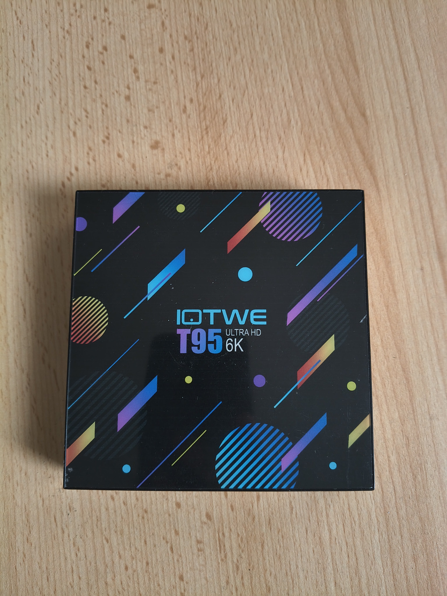
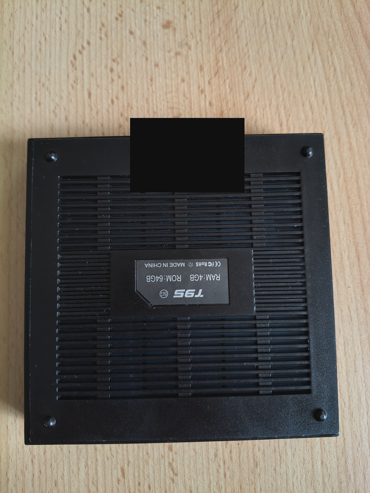
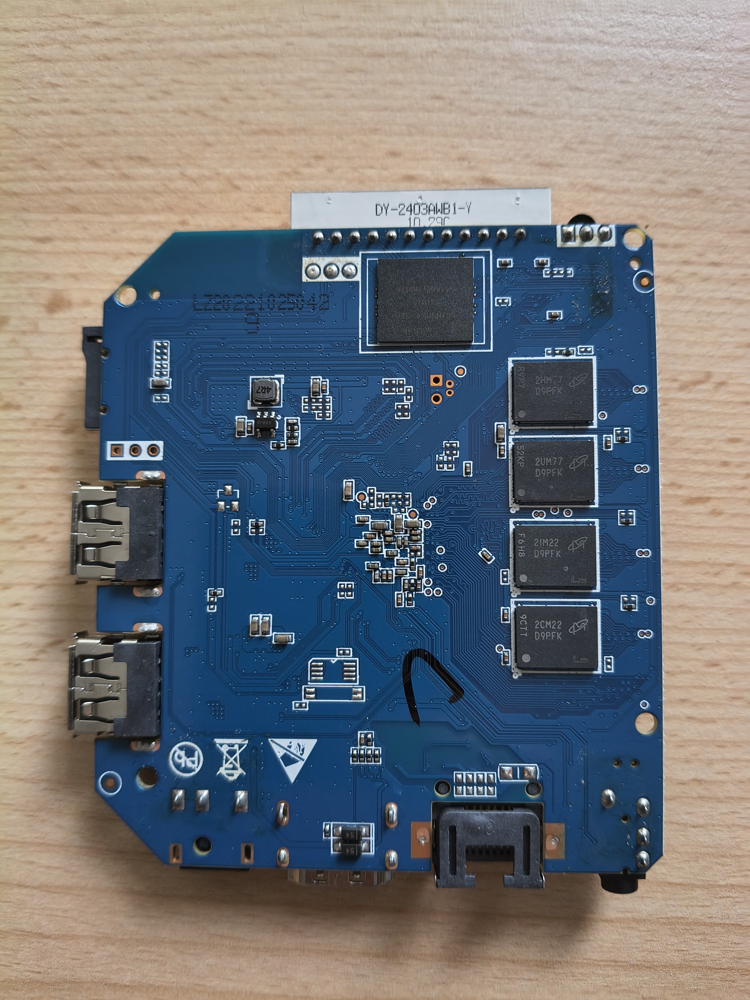
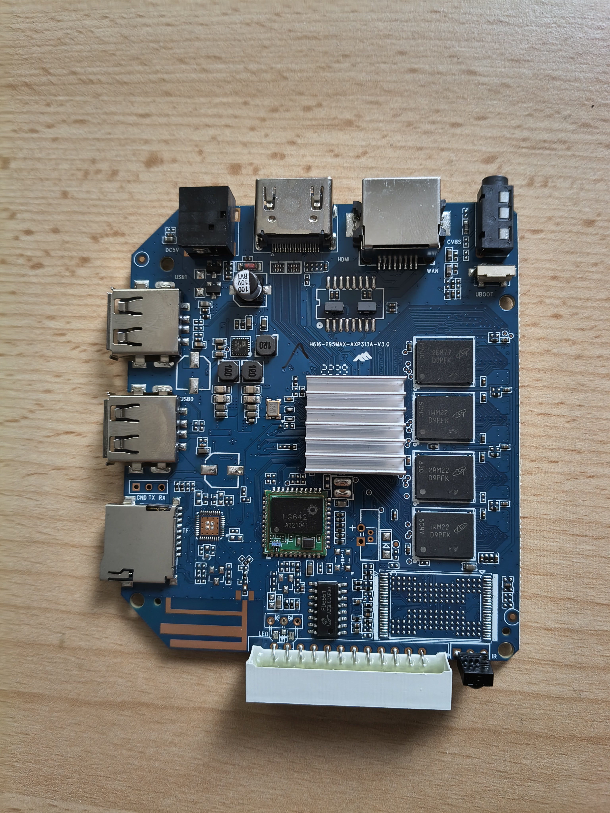

# T95 TV Box → Armbian Linux Home Server

[Deutsch](README.md) | **English**


A reproducible conversion of an Allwinner H616 T95 TV box into a small,
energy-efficient Armbian Linux home server. It documents boot bring-up,
Ethernet, UART diagnostics, and board-specific technical changes.

> [!NOTE]
> **Private hardware project:** this T95 originally had an Android installation
> classified or suspected as BadBox-affected. It was not reused as a trusted TV
> device. The successful outcome boots from microSD and provides Ethernet, SSH,
> and optional Samba file sharing without using the original Android system.

> [!WARNING]
> This release is for `H616-T95MAX-AXP313A-V3.0` only. “T95” is not a uniform
> hardware designation. Do not write the image to another box before checking
> its PCB, UART, and boot behavior.

## Hardware photos

Compare your board before downloading. The photos help identify the tested
hardware but do not replace electrical inspection. EXIF/GPS data was removed;
the individual MAC/barcode label is covered.

<p>
  
  
  
  
</p>

## UART before porting

> [!CAUTION]
> **Have a UART adapter before the first test.** UART is the primary way to
> diagnose a black screen, failed TOC0/U-Boot, DRAM/PMIC, DTB, or early kernel
> start. Use a **3.3 V TTL UART adapter**; do not connect 5 V TTL or RS-232.

Use common ground, 115200 baud, 8N1. A RP2040-Zero can be used with the
[RP2040-Zero UART adapter project](https://github.com/Web-Developer-DB/rp2040-zero-uart-adapter).

> [!IMPORTANT]
> **Other H616 boards:** the finished image is not for them. First use the
> host-only inventory, UART, and FEL/eGON workflow in the
> [H616 porting kit](docs/PORTING.en.md). It provides safe stop criteria before
> any SD or eMMC write.

## End-user quick start

This path is for the exact tested T95. You do not need to build U-Boot, a DTB,
or a kernel.

### One-script installation

Run this in the directory where you want working files:

```bash
bash <(curl -fsSL \
  https://raw.githubusercontent.com/Web-Developer-DB/t95-tvbox-to-armbian-home-server/main/tools/install-t95-release.sh)
```

It clones the release tools, downloads and verifies v1.0.0, creates a private
local image with your root password, shows available block devices, and asks
explicitly before writing removable storage. It never accesses T95 eMMC.

### Requirements

- Exact board: `H616-T95MAX-AXP313A-V3.0`.
- microSD, card reader, Ethernet cable, and a Linux PC.
- Native Linux is recommended. WSL2 is suitable only with reliable USB block
  device passthrough as `/dev/sdX`; PowerShell may still be needed for RP2040
  serial access.
- UART adapter ready before any hardware experiment.

### Manual installation

1. Download all six v1.0.0 assets and verify them:

   ```bash
   sha256sum -c SHA256SUMS
   xz -t T95-H616-AXP313A-Armbian-26.8.4-6.18.48-v1.0.0.img.xz
   ```

2. Clone the repository, extract the image, and create a personal local copy:

   ```bash
   git clone https://github.com/Web-Developer-DB/t95-tvbox-to-armbian-home-server.git
   cd t95-tvbox-to-armbian-home-server
   mkdir -p "$HOME/t95-private"
   xz -dk --keep /path/to/download/T95-H616-AXP313A-Armbian-26.8.4-6.18.48-v1.0.0.img.xz
   bash tools/provision-t95-release-image.sh \
     /path/to/download/T95-H616-AXP313A-Armbian-26.8.4-6.18.48-v1.0.0.img \
     "$HOME/t95-private/t95-personal.img" PROVISION-T95-ROOT-PASSWORD
   ```

3. Identify the target card after each insertion. `/dev/sdX` is a placeholder,
   not a literal device name:

   ```bash
   lsblk -b -o NAME,SIZE,MODEL,SERIAL,TRAN,RM,TYPE,MOUNTPOINTS
   ```

4. Write only the verified removable card:

   ```bash
   bash tools/write-t95-provisioned-image-to-sd.sh /dev/sdX \
     "$HOME/t95-private/t95-personal.img" \
     "$HOME/t95-private/t95-personal.img.t95-provisioned-manifest" \
     WRITE-T95-PROVISIONED-TO-SDX
   ```

5. Insert the card only while powered off, connect Ethernet, boot, locate the
   DHCP address, verify the SSH fingerprint, log in as `root`, and complete
   Armbian first-run setup.

6. Immediately hold the verified kernel and DTB packages:

   ```bash
   sudo apt-mark hold linux-image-current-sunxi64 linux-dtb-current-sunxi64
   apt-mark showhold
   ```

7. Create a complete private backup with [BACKUP.en.md](docs/BACKUP.en.md).

## Armbian baseline and T95 changes

The base is Armbian 26.8.4 / Debian 13 Trixie / kernel
`6.18.48-current-sunxi64` from the Tanix TX6s/AXP313 platform. Kernel,
initramfs, and rootfs remain mostly standard. The board-specific boot chain is
the essential difference.

| Component | T95-specific part | Verify on another board |
| --- | --- | --- |
| U-Boot / TOC0 | signed T95 loader, SD `mmc 0:1`, TOC0 at byte 8192 | SoC, DRAM, PMIC, Boot ROM |
| TF-A / BL31 | paired with T95 U-Boot | board variant, BL31 compatibility |
| DTB / environment | T95 identity, AC300/RMII, serial console, ext4 root | board, PHY, MDIO, clock, root path |
| Ethernet | AC300 pre-initialization for `end0` | PHY, reset, clock, MAC, link |
| Security | locked root; no host keys; create keys before SSH | personalize only locally |
| Samba / USB | separate optional module | install after stable Linux/network |

See the full [change inventory](docs/CHANGES_FROM_ARMBIAN.en.md) and
[porting kit](docs/PORTING.en.md).

## Verified status

- Allwinner H616, 4 × Cortex-A53, 2 GiB DDR3.
- Autonomous SD TOC0/U-Boot boot and ext4 root filesystem.
- AC300 Ethernet on `end0`, 100 Mbit/s full duplex, DHCP and SSH.
- CPU stress test passed; maximum observed temperature about 62 °C.
- microSD read about 22–23 MB/s, write about 21.5 MB/s without relevant errors.
- Internal eMMC works as a low-wear ext4 data drive; observed reads about
  63.8–77.4 MB/s, but eMMC boot is not the supported path.
- USB 2.0 mass storage read/write and optional automount are tested.

The complete acceptance matrix and hashes are in
[VALIDATION.en.md](docs/VALIDATION.en.md).

## eMMC as an internal data drive

eMMC is working internal storage but not the supported boot medium. Use it as
an ext4 data drive, for example at `/srv/T95-DATA`; the public release writer
does not access it. Do not use eMMC writes to repair a boot failure—check UART,
loader, DTB, and SD first.

## Samba and USB file server

After Linux and Ethernet are stable, the optional
[Samba + USB automount module](server/samba-usb/README.en.md) provides an
authenticated SMB2/SMB3 share, automatic USB mounting for the selected user,
one usershare per volume, safe eject, manifest checks, and recovery guidance.
Clients can use `smb://<SERVER-IP>/` or `\\<SERVER-IP>\`; VLC can stream
compatible files directly over SMB.

## UART diagnostics with RP2040-Zero

Connect `GP0` (adapter TX) to T95 RX, `GP1` (adapter RX) to T95 TX, and GND to
GND. For capture-only testing, leave adapter TX disconnected. Clone the
separate adapter project, then for example:

```bash
python3 tools/capture_uart.py /dev/ttyACM0 \
  --baud 115200 --duration 240 --prefix captures/d95-coldboot
```

Do not publish captures containing IPs, MACs, UUIDs, serial numbers, local
paths, or credentials. See [UART bring-up](docs/UART_BRINGUP.en.md) and
[boot troubleshooting](docs/BOOT_TROUBLESHOOTING.en.md).

## Security, backups, and updates

The release image has a locked root account and no SSH host keys, accounts,
`authorized_keys`, or machine identity. Personalization happens locally; never
publish a personal image or manifest. Back up the working SD using
[BACKUP.en.md](docs/BACKUP.en.md) before intentional kernel/DTB changes.

To change the tested package state deliberately:

```bash
sudo apt-mark unhold linux-image-current-sunxi64 linux-dtb-current-sunxi64
sudo apt update
sudo apt full-upgrade
```

Afterward, retest cold boot, DTB, AC300 Ethernet, and networking; apply the
holds again if the tested versions remain necessary.

## Developer build and porting

The public developer path uses pinned U-Boot/TF-A sources and a host-only
eGON/FEL diagnostic build without a private signing key. Optional TOC0 testing
uses a locally supplied key and makes no Secure Boot claim. Read
[PORTING.en.md](docs/PORTING.en.md), [build instructions](build/README.en.md),
and [source pins](build/PORTING_SOURCES.en.md) before changing boot components.

Historical laboratory scripts are reference material, not an update mechanism
for a working server SD card. For black screen or missing DHCP, inspect UART
before writing another image or touching eMMC.

## License

No license has been selected yet. Choose one and review the obligations of
Armbian, Linux, U-Boot, TF-A, and adopted patches before redistribution.
