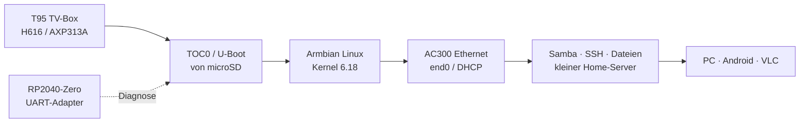
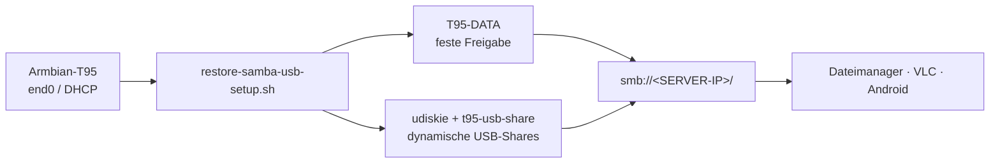

# T95 TV-Box → Armbian Linux Home Server


Ein geprüftes Armbian-System, das eine **T95-TV-Box mit Allwinner H616**
in einen kleinen, stromsparenden **Linux-Home-Server** verwandelt.
Die Box startet von microSD, ist per Ethernet und SSH erreichbar und kann
optional Dateien über Samba und USB-Laufwerke bereitstellen.

> [!WARNING]
> Dieses Projekt ist für genau die geprüfte Platine gedacht:
> `H616-T95MAX-AXP313A-V3.0`. Der Aufdruck „T95“ beschreibt keine
> einheitliche Hardware. Eine ähnlich aussehende Box darf das Image erst nach
> eigener Platinen-, UART- und Bootprüfung verwenden.

> [!NOTE]
> **Projektstatus:** Der dokumentierte Stand ist auf der geprüften Platine
> `H616-T95MAX-AXP313A-V3.0` stabil getestet. Boot, sauberes Herunterfahren,
> SSH und Dateizugriff wurden im praktischen Betrieb ohne beobachtete Fehler
> geprüft. Das ist keine Zusage für andere T95-Varianten oder für noch nicht
> getestete Langzeit- und Peripheriefunktionen.

## Inhaltsübersicht

- [Projektziel](#projektziel)
- [Endanwender-Schnellstart](#endanwender-schnellstart)
- [Geprüfte Hardware und Software](#geprüfte-hardware-und-software)
- [Nachgewiesener Stand](#nachgewiesener-stand)
- [eMMC als internes Datenlaufwerk](#emmc-als-internes-datenlaufwerk)
- [Hardware-Fotos](#hardware-fotos)
- [SD-Backup und Wiederherstellung](#sd-backup-und-wiederherstellung)
- [Samba- und USB-Dateiserver](#samba--und-usb-dateiserver)
- [UART-Diagnose mit RP2040-Zero](#uart-diagnose-mit-rp2040-zero)
- [Kernel- und DTB-Schutz](#kernel--und-dtb-schutz)
- [Sicherheitsgrenzen](#sicherheitsgrenzen)
- [Nützliche Projektdateien](#nützliche-projektdateien)
- [Optionale Weiterentwicklung](#optionale-weiterentwicklung)
- [Lizenz](#lizenz)

## Projektziel



Mit dem geprüften Release kannst du die Box ohne eigene Kernel- oder
Bootloader-Kompilierung als kleinen Server einrichten:

1. Release-Image und Prüfsumme herunterladen.
2. Eine lokale Kopie mit einem eigenen Root-Passwort erzeugen.
3. Die Kopie auf eine microSD-Karte schreiben.
4. Die T95 starten und den Armbian-Ersteinrichtungsdialog abschließen.
5. Per SSH verwalten und bei Bedarf Samba/USB-Freigaben aktivieren.

Für die normale Installation sind keine eigenen Änderungen am System nötig.

## Endanwender-Schnellstart

> [!TIP]
> Du musst weder U-Boot kompilieren noch ein Kernel- oder DTB-Image bauen.
> Lade das geprüfte Release-Image herunter, personalisiere es lokal und
> schreibe es auf eine microSD-Karte.

### Voraussetzungen

- eine T95 mit der geprüften Platine `H616-T95MAX-AXP313A-V3.0`;
- eine entbehrliche microSD-Karte (mindestens so groß wie das Release-Image);
- ein Linux-PC mit `bash`, `sudo`, `xz`, `sha256sum`, `lsblk`, `dd` und `e2fsck`;
- alternativ Windows 10/11 mit WSL2 sowie funktionierendem USB-/Blockgeräte-
  Passthrough. Für SD-Schreiben wird natives Linux ausdrücklich empfohlen;
- ein Netzwerkkabel zum Router und optional eine USB-Festplatte für Dateien.

> [!CAUTION]
> Alle Schreibbefehle überschreiben die ausgewählte SD-Karte vollständig.
> `/dev/sdX` ist **nur ein Platzhalter** und muss vor jedem Schreibvorgang
> durch das aktuell mit `lsblk` ermittelte SD-Gerät ersetzt werden. Niemals
> eine interne NVMe-, System- oder sonstige Festplatte auswählen.

### 1. Release herunterladen und prüfen

Lade aus dem [GitHub-Release](https://github.com/Web-Developer-DB/t95-tvbox-to-armbian-home-server/releases)
das Image und `SHA256SUMS` in denselben Ordner. Prüfe dort:

```bash
sha256sum -c SHA256SUMS
```

Nur bei einer erfolgreichen Prüfung fortfahren.

### 2. Persönliche lokale Image-Kopie erzeugen

Das öffentliche Image enthält absichtlich kein verwendbares Standardpasswort.
Erzeuge deshalb eine lokale Kopie mit einem eigenen Passwort. Das Passwort
bleibt außerhalb des Repositorys und wird nicht in GitHub veröffentlicht.

```bash
export REPO=/pfad/zum/t95-tvbox-to-armbian-home-server
export DOWNLOAD=/pfad/zum/GitHub-Release-Download
mkdir -p "$HOME/t95-private"

xz -dk --keep \
  "$DOWNLOAD/T95-H616-AXP313A-Armbian-26.8.4-6.18.48-v0.1.1.img.xz"

bash "$REPO/tools/provision-t95-release-image.sh" \
  "$DOWNLOAD/T95-H616-AXP313A-Armbian-26.8.4-6.18.48-v0.1.1.img" \
  "$HOME/t95-private/t95-personal.img" \
  PROVISION-T95-ROOT-PASSWORD
```

### 3. SD-Karte ermitteln und Image schreiben

SD-Karte einstecken und die Ausgabe unmittelbar vor dem Schreiben prüfen:

```bash
lsblk -b -o NAME,SIZE,MODEL,SERIAL,TRAN,RM,TYPE,MOUNTPOINTS
```

Das Ziel muss eine wechselbare USB-Karte (`RM=1`) sein. Danach `/dev/sdX`
im folgenden Befehl durch den **tatsächlichen** Gerätenamen ersetzen:

```bash
bash "$REPO/tools/write-t95-provisioned-image-to-sd.sh" \
  /dev/sdX \
  "$HOME/t95-private/t95-personal.img" \
  "$HOME/t95-private/t95-personal.img.t95-provisioned-manifest" \
  WRITE-T95-PROVISIONED-TO-SDX
```

Das Werkzeug hängt die Partitionen aus, schreibt das Image, liest es zurück
und prüft Hash, TOC0-Loader und ext4. Die Karte darf erst nach `ERFOLG`
entfernt werden.

### 4. T95 starten und per SSH anmelden

1. T95 vollständig ausschalten.
2. Die geprüfte microSD einsetzen und Ethernet mit dem Router verbinden.
3. T95 einschalten und im Router die neue DHCP-Adresse ablesen.
4. Per SSH verbinden, zum Beispiel `ssh root@<T95-IP>`.
5. Den Armbian-Ersteinrichtungsdialog abschließen und ein starkes Passwort
   verwenden.

Die Box bootet im unterstützten Releaseweg von microSD. Die interne eMMC wird
hierbei nicht verändert.

### 5. Optional: Dateien über USB/Samba freigeben

Nach erfolgreicher SSH-Anmeldung kann das optionale Modul
[`server/samba-usb/`](server/samba-usb/) installiert werden. Es richtet Samba,
USB-Automount und eine geschützte Dateifreigabe ein. Die vollständige
Endanwender-Anleitung steht in
[`server/samba-usb/README.md`](server/samba-usb/README.md).

### 6. Backup erstellen

Nach der Ersteinrichtung zuerst ein vollständiges SD-Backup auf dem PC anlegen.
Die sichere Schrittfolge steht in [`docs/BACKUP.md`](docs/BACKUP.md). Backups
enthalten persönliche Daten und gehören nicht in GitHub.

> [!NOTE]
> Wenn die Box nicht startet oder keine DHCP-Adresse erhält, nicht sofort ein
> anderes Image schreiben. Prüfe zuerst Stromversorgung, microSD-Sitz und
> DHCP-Lease im Router. Wenn weiterhin kein Start möglich ist, hilft die
> [UART-Diagnose mit dem RP2040-Zero](#uart-diagnose-mit-rp2040-zero).

## Geprüfte Hardware und Software

| Bereich | Nachgewiesene Konfiguration |
| --- | --- |
| Platine | `H616-T95MAX-AXP313A-V3.0` |
| SoC | Allwinner H616, 4 × Cortex-A53 |
| PMIC | AXP313A |
| Arbeitsspeicher | 2 GiB DRAM |
| Ethernet | Allwinner AC300 EPHY, RMII, 100 Mbit/s Full Duplex |
| Systemmedium | 128-GB-microSD (`/dev/mmcblk0`) |
| Interner Speicher | ca. 32-GB-eMMC (`/dev/mmcblk2`), Lesen/Schreiben geprüft; als ext4-Datenlaufwerk nutzbar |
| Distribution | Armbian 26.8.4, Debian 13 Trixie |
| Kernel | `6.18.48-current-sunxi64` |
| DTB | `sun50i-h616-t95-axp313-tanix-6.18.dtb` |
| Bootmedium | microSD, TOC0-Loader ab Byte 8192 |

## Nachgewiesener Stand

| Test | Ergebnis | Hinweis |
| --- | :---: | --- |
| SD-Boot mit eigenem TOC0-/U-Boot | ✅ | eMMC bleibt dabei unverändert |
| DRAM-Initialisierung | ✅ | 2 GiB erkannt |
| Ethernet / DHCP / SSH | ✅ | `end0`, 100 Mbit/s, IPv4/IPv6 und DNS getestet |
| Endanwender-Start | ✅ | Start aus ausgeschaltetem Zustand von microSD geprüft |
| Sauberes Herunterfahren | ✅ | kontrolliertes Herunterfahren im Betrieb geprüft |
| Dateizugriff | ✅ | Dateien über den eingerichteten Serverpfad erreichbar |
| eMMC als ext4-Datenlaufwerk | ✅ | interner Speicher funktioniert als Datenmedium; Einbindung ist installationsabhängig |
| Armbian-Boot von eMMC | ❌ | Installations-/Bootversuch fehlgeschlagen; microSD bleibt der unterstützte Bootweg |
| CPU-Dauerlast | ✅ | 4 Worker, 10 Minuten, ca. 62 °C maximal |
| microSD-I/O | ✅ | etwa 22–23 MB/s Lesen und 21,5 MB/s Schreiben |
| eMMC-I/O | ✅ | ca. 63,8–77,4 MB/s Lesen; Schreiben für diesen Stand nicht belastbar gemessen |
| eMMC-Gesundheit | ✅ | Life Time A/B und Pre-EOL jeweils `0x01` |
| WLAN / Bluetooth / GPU / Audio | ⚠️ | für den headless Server nicht erforderlich bzw. unvollständig |
| Samba `T95-DATA` | ✅ | authentifizierte SMB2/SMB3-Freigabe getestet |
| USB-Automount und dynamische Usershares | ✅ | Label-/Fallback-Namen, Auswurf und Wiedereinstecken getestet |
| VLC-Wiedergabe über SMB | ✅ | lokale Netzwerk-Wiedergabe erfolgreich geprüft |

Die Samba-/USB-Ausbaustufe sowie die Endanwender-Abnahme mit Start,
Herunterfahren und Dateizugriff sind damit bestanden. Langzeitmessungen,
weitere Peripherie und eine endgültige Kernel-/Timer-Konfiguration bleiben
optionale Weiterentwicklungen und ändern den stabil getesteten Grundstand
nicht.

## eMMC als internes Datenlaufwerk

Die T95 besitzt neben dem microSD-Steckplatz einen internen eMMC-Speicher. Unter
Armbian wird er als `/dev/mmcblk2` mit einer nutzbaren Kapazität von etwa
29,1 GiB erkannt (entspricht nominell 32 GB). Die vom eMMC-Standard
bereitgestellten Bootbereiche sind ebenfalls vorhanden:

```text
/dev/mmcblk2boot0   4 MiB
/dev/mmcblk2boot1   4 MiB
```

Für den Serverbetrieb wurde der Nutzbereich als eigene ext4-Datenpartition
eingerichtet:

```text
/dev/mmcblk2p1   ext4   Label: T95-DATA   Mountpoint: /srv/T95-DATA
```

Die konkrete UUID wird absichtlich nicht dokumentiert. Sie gehört zur jeweils
verwendeten eMMC-Partition und muss bei einer eigenen Einrichtung mit
`blkid` bzw. `findmnt` ermittelt werden.

### Leistung und Verschleiß

Die protokollierten sequenziellen Lesetests ergaben:

| Medium / Test | Ergebnis |
| --- | ---: |
| eMMC, direkter Lesetest | ca. 77,4 MB/s |
| eMMC, `hdparm` | ca. 63,8 MB/s |
| microSD, Lesen | ca. 23,4 MB/s |
| microSD, Schreiben | ca. 21,5 MB/s |

Damit liest die eMMC ungefähr drei Mal schneller als die verwendete microSD.
Ein belastbarer eMMC-Schreibwert liegt für diesen Versuchsstand nicht vor und
wird deshalb nicht angegeben.

Die eMMC-Health-Register wurden mit `mmc-utils` geprüft:

```text
DEVICE_LIFE_TIME_EST_TYP_A = 0x01
DEVICE_LIFE_TIME_EST_TYP_B = 0x01
PRE_EOL_INFO               = 0x01
```

`0x01` steht bei den beiden Lifetime-Feldern für etwa 0–10 % der
spezifizierten Lebensdauer und beim Pre-EOL-Feld für einen normalen Zustand.
Die getestete eMMC zeigte somit keinen nennenswerten Verschleiß. Diese
Hersteller-Schätzwerte ersetzen keine Backups und sind keine Garantie für die
zukünftige Lebensdauer.

### Bootstrategie

Ein vollständiger Armbian-Start von der eMMC wurde versucht, war mit dem
generischen eMMC-Bootloader auf dieser konkreten H616-/AXP313A-Platine jedoch
nicht zuverlässig möglich. Das Problem lag im Bootpfad, nicht an der
Dateisystem- oder eMMC-Gesundheit. Der reproduzierbare Stand verwendet daher:

```text
microSD  → TOC0-/U-Boot und Armbian-System
eMMC     → dauerhaftes ext4-Datenlaufwerk (T95-DATA)
```

Diese Aufteilung verändert die Android-eMMC nicht automatisch und macht sie
nicht bootfähig. Sie bietet trotzdem eine schnelle interne Ablage für Backups,
Samba-Dateien und andere Serverdaten.

Das öffentliche SD-Release beschreibt die interne eMMC nicht. Wenn du sie als
Datenlaufwerk verwenden möchtest, partitioniere und formatiere sie bewusst,
erstelle vorher ein eigenes Backup und binde sie anschließend zum Beispiel
unter `/srv/T95-DATA` ein. Die eMMC wird dadurch nicht zu einem bootfähigen
Armbian-System.

Das integrierte Ethernet ist auf 100 Mbit/s begrenzt; gemessen wurden etwa
94,5 Mbit/s beziehungsweise ungefähr 11–12 MB/s Nutzdaten pro Sekunde. Bei
Samba-Zugriffen ist daher das Netzwerk und nicht die eMMC der limitierende
Faktor.

## Hardware-Fotos

Die Fotos zeigen die tatsächlich geprüfte Platine und das Gehäuse. Sie dienen
der visuellen Zuordnung und ersetzen keine elektrische Prüfung. EXIF-/GPS-Daten
wurden entfernt; der individuelle MAC-/Barcode-Aufkleber ist abgedeckt.

<p>
  
  
  
  
</p>

### SSH-Statusansicht

Die folgende anonymisierte Sitzung zeigt den erfolgreichen Armbian-Start und
die verfügbaren Systeminformationen nach der SSH-Anmeldung. Netzwerkadressen,
der letzte Login-Absender und der lokale Hostname wurden durch
Dokumentationswerte ersetzt.


> [!NOTE]
> **Datenschutz-Hinweis:** Das Bild basiert auf einer echten SSH-Sitzung des
> getesteten Systems, ist für die Veröffentlichung aber sichtbar bereinigt.
> LAN-/WAN-Adressen, IPv6-Adressen, der letzte Login-Absender und der lokale
> Hostname wurden durch neutrale Dokumentationswerte ersetzt. Es handelt sich
> daher nicht um eine unveränderte Live-Aufnahme.

## SD-Backup und Wiederherstellung

Vor Kernel-, DTB- oder Serveränderungen sollte ein vollständiges Abbild der
laufenden SD-Karte erstellt werden. Die Anleitung in
[`docs/BACKUP.md`](docs/BACKUP.md) liest das komplette wechselbare Gerät,
prüft das komprimierte Archiv per zstd und SHA-256 und beschreibt die
Wiederherstellung auf eine gleich große Ersatzkarte.

> [!CAUTION]
> Ein Vollbackup enthält Konten, SSH-/Samba-Konfiguration und möglicherweise
> weitere persönliche Daten. Es bleibt lokal oder auf einem geschützten
> Zweitdatenträger und wird nicht als GitHub-Release veröffentlicht.

Kurzablauf:

```text
Box sauber herunterfahren → SD-Gerät mit lsblk prüfen → Partitionen aushängen
→ vollständiges /dev/sdX-Image lesen → zstd- und SHA-256-Prüfung
→ bei Bedarf nur auf eine geprüfte Ersatz-SD zurückschreiben
```

Die interne Android-eMMC wird durch den SD-Backup-Weg weder gelesen noch
beschrieben. Die eMMC kann separat als ext4-Datenlaufwerk eingebunden werden;
sie ist dadurch nicht automatisch ein bootfähiges Armbian-System.

## Samba- und USB-Dateiserver

Die T95 kann nach dem Armbian-Erststart als kleiner, stromsparender Datei- und
Medienserver betrieben werden. Das Modul in
[`server/samba-usb/`](server/samba-usb/) richtet eine feste interne Freigabe
`T95-DATA` und automatisch je eine eigene Freigabe für jedes eingesteckte
USB-Laufwerk ein.



> [!IMPORTANT]
> Die Installation wird auf der laufenden T95-Armbian-Box ausgeführt, nicht
> auf der laufenden T95. Ein bestehender Linux-Benutzer wird als `T95_USER`
> übergeben; das Samba-Passwort wird interaktiv gesetzt und nicht im
> Repository gespeichert.

Schnellpfad nach der SSH-Anmeldung:

```bash
cd /pfad/zum/checkout/server/samba-usb
sha256sum -c MANIFEST.sha256
sudo T95_USER=serveruser ./scripts/restore-samba-usb-setup.sh
```

Danach USB-Datenträger einstecken und die Freigaben prüfen:

```bash
sudo -u serveruser net usershare list
```

Vom Client aus ist die Serverwurzel der bevorzugte Einstieg:
`smb://<SERVER-IP>/` (unter Windows auch `\\<SERVER-IP>\\`). Eine
ausführliche, reproduzierbare Anleitung mit Voraussetzungen, Erfolgskriterien,
VLC-Beispiel, sicherem Auswurf und Fehlerdiagnose steht in
[`server/samba-usb/README.md`](server/samba-usb/README.md).

> [!CAUTION]
> Das Restore-Skript sichert eine vorhandene `/etc/samba/smb.conf` mit
> Zeitstempel und ersetzt sie anschließend durch die bekannte
> Projektkonfiguration. Vor dem Einsatz auf einem produktiven Samba-Server
> zuerst die Sicherung und die [technische Dokumentation](server/samba-usb/docs/SAMBA-USB-SETUP.md)
> prüfen.

## UART-Diagnose mit RP2040-Zero

Für Bootaufzeichnungen wurde ein **RP2040-Zero** als externer USB-zu-TTL-
UART-Adapter verwendet. Das separate Firmware- und Verdrahtungsprojekt steht
hier:

[Web-Developer-DB/rp2040-zero-uart-adapter](https://github.com/Web-Developer-DB/rp2040-zero-uart-adapter)

Elektrische Eckdaten:

| RP2040-Zero | T95 |
| --- | --- |
| `GP0` (TX) | T95-RX |
| `GP1` (RX) | T95-TX |
| `GND` | gemeinsame Masse |

* 3,3-V-TTL, 115200 Baud, 8N1 verwenden.
* 5-V-TTL und echtes RS-232 niemals direkt anschließen.
* Für reine Bootaufzeichnung kann die TX-Leitung des Adapters getrennt bleiben.
* UART-Aufzeichnungen können persönliche Daten enthalten und gehören nicht in
  GitHub.

Beispiel für eine Aufzeichnung:

```bash
python3 tools/capture_uart.py /dev/ttyACM1 \
  --baud 115200 \
  --duration 240 \
  --prefix captures/d95-coldboot
```

## Kernel- und DTB-Schutz

Die geprüfte Kernel-/DTB-Kombination sollte nach der Ersteinrichtung nicht
ungefragt durch ein Paketupdate ersetzt werden:

```bash
sudo apt-mark hold linux-image-current-sunxi64 linux-dtb-current-sunxi64
apt-mark showhold
uname -r
```

Vor einem bewusst geplanten Update zuerst ein vollständiges Backup erstellen,
UART bereithalten und die Sperre gezielt aufheben:

```bash
sudo apt-mark unhold linux-image-current-sunxi64 linux-dtb-current-sunxi64
sudo apt update
sudo apt full-upgrade
```

Danach DTB, AC300-Ethernet, Kaltstart und Netzwerk erneut prüfen. Die Sperre ist
eine Schutzmaßnahme für den nachgewiesenen Stand, kein Ersatz für
Sicherheitsupdates oder Backups.

## Sicherheitsgrenzen

> [!CAUTION]
> Dieses Projekt entfernt oder bereinigt die Android-eMMC nicht automatisch.
> Ein möglicher BADBOX-Befund der alten Firmware wird weder übernommen noch
> als Vertrauensquelle verwendet.

- Der normale Release-Weg startet von microSD und beschreibt die eMMC nicht.
- Vor jedem SD-Schreibvorgang Gerät, Größe, Seriennummer und `RM=1` prüfen.
- Loader, DTB und Root-Dateisystem nur mit dokumentierten Werkzeugen ändern.
- Backups, UART-Captures, Artefakte, private Schlüssel und persönliche Images
  bleiben lokal und sind durch `.gitignore` ausgeschlossen.
- `clk_ignore_unused nohz=off` sind vorläufige Diagnoseparameter, keine
  endgültige Serverkonfiguration.

## Nützliche Projektdateien

| Pfad | Zweck |
| --- | --- |
| [`docs/RELEASE.md`](docs/RELEASE.md) | geprüfter Releaseweg und Grenzen |
| [`docs/VALIDATION.md`](docs/VALIDATION.md) | öffentliche Testmatrix und Hash-Nachweise |
| [`docs/BACKUP.md`](docs/BACKUP.md) | vollständiges SD-Backup und Wiederherstellung |
| [`tools/provision-t95-release-image.sh`](tools/provision-t95-release-image.sh) | lokale Passwort-Initialisierung |
| [`tools/write-t95-provisioned-image-to-sd.sh`](tools/write-t95-provisioned-image-to-sd.sh) | verifizierter SD-Schreiber |
| [`server/samba-usb/`](server/samba-usb/) | Samba- und USB-Automount für den Home-Server |
| [`docs/images/`](docs/images/) | bereinigte Hardware-Fotos |

## Optionale Weiterentwicklung

- ⏳ zusätzliche Langzeitmessungen und weitere Kaltstartserien
- ⏳ Entscheidung über eine endgültige Kernel-/Timer-Konfiguration
- ⏳ optionale Unterstützung für WLAN, Audio, HDMI und Fernbedienung

Diese Punkte sind nicht Voraussetzung für den dokumentierten Home-Server-Betrieb.

## Lizenz

Für dieses Repository ist derzeit keine Lizenz festgelegt. Beachte die
Lizenzhinweise des Projekts und der enthaltenen Armbian-/Upstream-Bestandteile,
bevor du Dateien weiterverwendest oder veröffentlichst.
