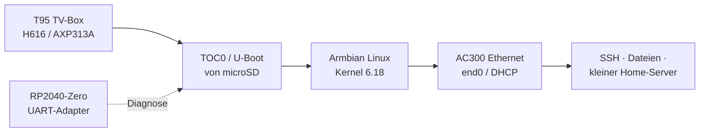

# T95 TV-Box → Armbian Linux Home Server


Ein reproduzierbarer Umbauversuch, der eine **T95-TV-Box mit Allwinner H616**
in einen kleinen, stromsparenden **Armbian-Linux-Home-Server** verwandelt.
Der Schwerpunkt liegt auf nachvollziehbarem Boot- und Hardware-Bring-up,
Ethernet, UART-Diagnose und einem sicheren Veröffentlichungsweg.

> [!WARNING]
> Dieses Projekt ist für genau die geprüfte Platine gedacht:
> `H616-T95MAX-AXP313A-V3.0`. Der Aufdruck „T95“ beschreibt keine
> einheitliche Hardware. Eine ähnlich aussehende Box darf das Image erst nach
> eigener Platinen-, UART- und Bootprüfung verwenden.

## Inhaltsübersicht

- [Projektziel](#projektziel)
- [Geprüfte Hardware und Software](#geprüfte-hardware-und-software)
- [Nachgewiesener Stand](#nachgewiesener-stand)
- [Hardware-Fotos](#hardware-fotos)
- [Schnellstart](#schnellstart)
- [UART-Diagnose mit RP2040-Zero](#uart-diagnose-mit-rp2040-zero)
- [Kernel- und DTB-Schutz](#kernel--und-dtb-schutz)
- [Sicherheitsgrenzen](#sicherheitsgrenzen)
- [Projektstruktur](#projektstruktur)
- [Reproduzierbarer Build und Release](#reproduzierbarer-build-und-release)
- [Offene Arbeiten](#offene-arbeiten)
- [Lizenz](#lizenz)

## Projektziel



Das Repository dokumentiert nicht nur ein fertiges Image, sondern die Schritte,
mit denen der Start reproduziert und im Fehlerfall zurückverfolgt werden kann:

1. Platine identifizieren und UART anschließen.
2. T95-spezifischen TOC0-/U-Boot-Loader auf microSD testen.
3. Armbian mit passendem DTB und AC300-Ethernet starten.
4. Erststart, Netzwerk und Stabilität prüfen.
5. Ein generisches Release-Image lokal mit eigenem Zugang personalisieren.

## Geprüfte Hardware und Software

| Bereich | Nachgewiesene Konfiguration |
| --- | --- |
| Platine | `H616-T95MAX-AXP313A-V3.0` |
| SoC | Allwinner H616, 4 × Cortex-A53 |
| PMIC | AXP313A |
| Arbeitsspeicher | 2 GiB DRAM |
| Ethernet | Allwinner AC300 EPHY, RMII, 100 Mbit/s Full Duplex |
| Systemmedium | 128-GB-microSD (`/dev/mmcblk0`) |
| Interner Speicher | ca. 32-GB-eMMC (`/dev/mmcblk2`), in diesem SD-Release nicht beschrieben |
| Distribution | Armbian 26.8.4, Debian 13 Trixie |
| Kernel | `6.18.48-current-sunxi64` |
| DTB | `sun50i-h616-t95-axp313-tanix-6.18.dtb` |
| Bootmedium | microSD, TOC0-Loader ab Byte 8192 |

## Nachgewiesener Stand

| Test | Ergebnis | Hinweis |
| --- | :---: | --- |
| SD-Boot mit eigenem TOC0-/U-Boot | ✅ | eMMC bleibt dabei unverändert |
| DRAM-Initialisierung | ✅ | 2 GiB erkannt |
| Ethernet / DHCP / SSH | ✅ | `end0`, 100 Mbit/s, IPv4/IPv6 und DNS getestet |
| CPU-Dauerlast | ✅ | 4 Worker, 10 Minuten, ca. 62 °C maximal |
| microSD-I/O | ✅ | etwa 22–23 MB/s Lesen und 21,5 MB/s Schreiben |
| eMMC-Gesundheit | ✅ | Life Time A/B und Pre-EOL jeweils `0x01` |
| WLAN / Bluetooth / GPU / Audio | ⚠️ | für den headless Server nicht erforderlich bzw. unvollständig |
| SMB, USB-Platte, VLC-Wiedergabe | ⏳ | Folgearbeiten, noch keine Release-Zusage |

Der erreichte Stand eignet sich als Basis für einen kleinen Dateiserver. Die
Langzeitstabilität und die endgültige Home-Server-Abnahme müssen separat
geprüft werden.

## Hardware-Fotos

Die Fotos zeigen die tatsächlich geprüfte Platine und das Gehäuse. Sie dienen
der visuellen Zuordnung und ersetzen keine elektrische Prüfung. EXIF-/GPS-Daten
wurden entfernt; der individuelle MAC-/Barcode-Aufkleber ist abgedeckt.

<p>
  
  
  
  
</p>

## Schnellstart

> [!IMPORTANT]
> Das öffentliche Image ist absichtlich generisch: Root ist gesperrt und es
> enthält keine privaten SSH-Hostschlüssel. Vor dem Schreiben wird lokal eine
> persönliche Kopie mit eigenem Passwort erzeugt.

### 1. Release-Dateien prüfen

Aus dem GitHub-Release herunterladen und im Download-Verzeichnis prüfen:

```bash
sha256sum -c SHA256SUMS
```

Das Release-Image heißt:

```text
T95-H616-AXP313A-Armbian-26.8.4-6.18.48-v0.1.1-hardened-experimental.img.xz
```

### 2. Lokale Image-Kopie personalisieren

Das folgende Werkzeug läuft auf dem Linux-PC und schreibt nur eine lokale
Kopie. Das Passwort wird nicht in einem Manifest oder im Repository abgelegt.

```bash
export REPO=/pfad/zum/t95-tvbox-to-armbian-home-server
export DOWNLOAD=/pfad/zum/GitHub-Release-Download
mkdir -p "$HOME/t95-private"

xz -dk --keep \
  "$DOWNLOAD/T95-H616-AXP313A-Armbian-26.8.4-6.18.48-v0.1.1-hardened-experimental.img.xz"

bash "$REPO/tools/provision-t95-release-image.sh" \
  "$DOWNLOAD/T95-H616-AXP313A-Armbian-26.8.4-6.18.48-v0.1.1-hardened-experimental.img" \
  "$HOME/t95-private/t95-personal.img" \
  PROVISION-T95-ROOT-PASSWORD
```

Die persönliche `.img`-Datei und die zugehörige
`.t95-provisioned-manifest`-Datei bleiben außerhalb von GitHub.

### 3. SD-Karte eindeutig bestimmen

Nach jedem Einstecken den Gerätenamen neu prüfen. Niemals blind `/dev/sda`
verwenden:

```bash
lsblk -b -o NAME,SIZE,MODEL,SERIAL,TRAN,RM,TYPE,MOUNTPOINTS
```

Das Ziel muss eine entbehrliche, wechselbare microSD-Karte (`RM=1`) sein.

### 4. Persönliches Image schreiben

Das Werkzeug prüft Gerätekennung, Manifest, Image-Hash und liest die Karte
nach dem Schreiben zurück. Die interne eMMC wird nicht angesprochen.

```bash
bash "$REPO/tools/write-t95-provisioned-image-to-sd.sh" \
  /dev/sdX \
  "$HOME/t95-private/t95-personal.img" \
  "$HOME/t95-private/t95-personal.img.t95-provisioned-manifest" \
  WRITE-T95-PROVISIONED-TO-SDX
```

### 5. Kaltstart und Ersteinrichtung

1. SD-Karte nur bei ausgeschalteter T95 einsetzen.
2. Ethernet mit dem Router verbinden.
3. T95 einschalten und die DHCP-Lease im Router ablesen.
4. Per SSH anmelden und den Armbian-Ersteinrichtungsdialog abschließen.

Es gibt kein veröffentlichtes Standardpasswort. Beim ersten Start werden
eigene SSH-Hostschlüssel erzeugt, bevor `sshd` Verbindungen annimmt.

## UART-Diagnose mit RP2040-Zero

Für Bootaufzeichnungen wurde ein **RP2040-Zero** als externer USB-zu-TTL-
UART-Adapter verwendet. Das separate Firmware- und Verdrahtungsprojekt steht
hier:

[Web-Developer-DB/rp2040-zero-uart-adapter](https://github.com/Web-Developer-DB/rp2040-zero-uart-adapter)

Elektrische Eckdaten:

| RP2040-Zero | T95 |
| --- | --- |
| `GP0` (TX) | T95-RX |
| `GP1` (RX) | T95-TX |
| `GND` | gemeinsame Masse |

* 3,3-V-TTL, 115200 Baud, 8N1 verwenden.
* 5-V-TTL und echtes RS-232 niemals direkt anschließen.
* Für reine Bootaufzeichnung kann die TX-Leitung des Adapters getrennt bleiben.
* Capture-Dateien gehören ins lokale Labor und werden nicht veröffentlicht.

Beispiel für eine Aufzeichnung:

```bash
python3 tools/capture_uart.py /dev/ttyACM1 \
  --baud 115200 \
  --duration 240 \
  --prefix captures/d95-coldboot
```

## Kernel- und DTB-Schutz

Die geprüfte Kernel-/DTB-Kombination sollte nach der Ersteinrichtung nicht
ungefragt durch ein Paketupdate ersetzt werden:

```bash
sudo apt-mark hold linux-image-current-sunxi64 linux-dtb-current-sunxi64
apt-mark showhold
uname -r
```

Vor einem bewusst geplanten Update zuerst ein vollständiges Backup erstellen,
UART bereithalten und die Sperre gezielt aufheben:

```bash
sudo apt-mark unhold linux-image-current-sunxi64 linux-dtb-current-sunxi64
sudo apt update
sudo apt full-upgrade
```

Danach DTB, AC300-Ethernet, Kaltstart und Netzwerk erneut prüfen. Die Sperre ist
eine Schutzmaßnahme für den nachgewiesenen Stand, kein Ersatz für
Sicherheitsupdates oder Backups.

## Sicherheitsgrenzen

> [!CAUTION]
> Dieses Projekt entfernt oder bereinigt die Android-eMMC nicht automatisch.
> Ein möglicher BADBOX-Befund der alten Firmware wird weder übernommen noch
> als Vertrauensquelle verwendet.

- Der normale Release-Weg startet von microSD und beschreibt die eMMC nicht.
- Vor jedem SD-Schreibvorgang Gerät, Größe, Seriennummer und `RM=1` prüfen.
- Loader, DTB und Root-Dateisystem nur mit dokumentierten Werkzeugen ändern.
- Backups, UART-Captures, Artefakte, private Schlüssel und persönliche Images
  bleiben lokal und sind durch `.gitignore` ausgeschlossen.
- `clk_ignore_unused nohz=off` sind vorläufige Diagnoseparameter, keine
  endgültige Serverkonfiguration.

## Projektstruktur

| Pfad | Zweck |
| --- | --- |
| [`docs/RELEASE.md`](docs/RELEASE.md) | geprüfter Releaseweg und Grenzen |
| [`docs/VALIDATION.md`](docs/VALIDATION.md) | öffentliche Testmatrix und Hash-Nachweise |
| [`docs/PUBLISHING.md`](docs/PUBLISHING.md) | Veröffentlichungs- und Geheimnisprüfung |
| [`docs/GITHUB_RELEASE_NOTES.md`](docs/GITHUB_RELEASE_NOTES.md) | Textbausteine für ein GitHub-Release |
| [`build/README.md`](build/README.md) | hostseitige Buildkette |
| [`build/patches/`](build/patches/) | versionierte T95-/AC300-Patches |
| [`tools/provision-t95-release-image.sh`](tools/provision-t95-release-image.sh) | lokale Passwort-Initialisierung |
| [`tools/write-t95-provisioned-image-to-sd.sh`](tools/write-t95-provisioned-image-to-sd.sh) | verifizierter SD-Schreiber |
| [`docs/images/`](docs/images/) | bereinigte Hardware-Fotos |

## Reproduzierbarer Build und Release

Die Buildkette wird auf dem Linux-PC ausgeführt. Eine Übersicht steht in
[`build/README.md`](build/README.md). Der sichere Ablauf ist:

```text
Quelle vorbereiten → DTB/Rootfs bauen → Image härten →
Image auditieren → Release-Manifest erzeugen → lokal personalisieren → SD schreiben
```

Das generische Release-Image wird offline auf folgende Eigenschaften geprüft:

- Rootkonto gesperrt;
- keine privaten SSH-Hostschlüssel im Image;
- Hostschlüssel-Erzeugung vor dem Start von `sshd`;
- leere `machine-id`;
- bereinigte freie ext4-Blöcke;
- SHA-256-Prüfsummen für Image, Loader und DTB.

Das große Image gehört als Release-Asset zu GitHub, nicht in den Git-Verlauf.

## Offene Arbeiten

- ⏳ Kaltstart-Abnahme des gehärteten, lokal personalisierten Release-Images
- ⏳ USB-Platte und SMB2/SMB3-Freigabe
- ⏳ VLC-Wiedergabe aus dem lokalen Netz
- ⏳ mehrere Kaltstarts und längere Stabilitätsmessung
- ⏳ Entscheidung über eine endgültige Kernel-/Timer-Konfiguration

Bis diese Punkte abgeschlossen sind, bleibt der Status **experimentell**.

## Lizenz

Für dieses Repository ist derzeit absichtlich noch keine Lizenz festgelegt.
Vor einer Weiterveröffentlichung müssen die Lizenz des Projekts und die
Lizenzen aller übernommenen Upstream-Bestandteile geprüft werden.
