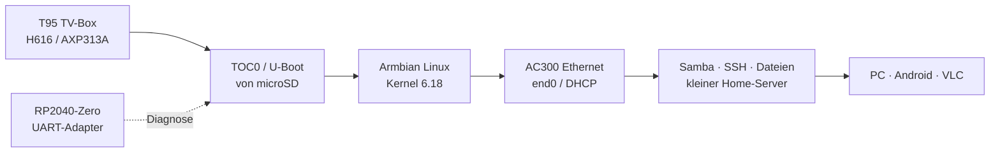
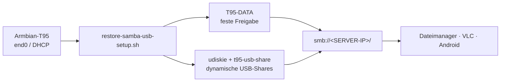

# T95 TV-Box → Armbian Linux Home Server


Ein reproduzierbarer Umbauversuch, der eine **T95-TV-Box mit Allwinner H616**
in einen kleinen, stromsparenden **Armbian-Linux-Home-Server** verwandelt.
Der Schwerpunkt liegt auf nachvollziehbarem Boot- und Hardware-Bring-up,
Ethernet, UART-Diagnose und einem sicheren Veröffentlichungsweg.

> [!WARNING]
> Dieses Projekt ist für genau die geprüfte Platine gedacht:
> `H616-T95MAX-AXP313A-V3.0`. Der Aufdruck „T95“ beschreibt keine
> einheitliche Hardware. Eine ähnlich aussehende Box darf das Image erst nach
> eigener Platinen-, UART- und Bootprüfung verwenden.

## Inhaltsübersicht

- [Projektziel](#projektziel)
- [Geprüfte Hardware und Software](#geprüfte-hardware-und-software)
- [Nachgewiesener Stand](#nachgewiesener-stand)
- [eMMC als internes Datenlaufwerk](#emmc-als-internes-datenlaufwerk)
- [Hardware-Fotos](#hardware-fotos)
- [Schnellstart](#schnellstart)
- [SD-Backup und Wiederherstellung](#sd-backup-und-wiederherstellung)
- [Samba- und USB-Dateiserver](#samba--und-usb-dateiserver)
- [UART-Diagnose mit RP2040-Zero](#uart-diagnose-mit-rp2040-zero)
- [Kernel- und DTB-Schutz](#kernel--und-dtb-schutz)
- [Sicherheitsgrenzen](#sicherheitsgrenzen)
- [Projektstruktur](#projektstruktur)
- [Reproduzierbarer Build und Release](#reproduzierbarer-build-und-release)
- [Offene Arbeiten](#offene-arbeiten)
- [Lizenz](#lizenz)

## Projektziel



Das Repository dokumentiert nicht nur ein fertiges Image, sondern die Schritte,
mit denen der Start reproduziert und im Fehlerfall zurückverfolgt werden kann:

1. Platine identifizieren und UART anschließen.
2. T95-spezifischen TOC0-/U-Boot-Loader auf microSD testen.
3. Armbian mit passendem DTB und AC300-Ethernet starten.
4. Erststart, Netzwerk und Stabilität prüfen.
5. Samba-/USB-Dateiserver reproduzierbar einrichten.
6. Ein generisches Release-Image lokal mit eigenem Zugang personalisieren.

## Geprüfte Hardware und Software

| Bereich | Nachgewiesene Konfiguration |
| --- | --- |
| Platine | `H616-T95MAX-AXP313A-V3.0` |
| SoC | Allwinner H616, 4 × Cortex-A53 |
| PMIC | AXP313A |
| Arbeitsspeicher | 2 GiB DRAM |
| Ethernet | Allwinner AC300 EPHY, RMII, 100 Mbit/s Full Duplex |
| Systemmedium | 128-GB-microSD (`/dev/mmcblk0`) |
| Interner Speicher | ca. 32-GB-eMMC (`/dev/mmcblk2`), Lesen/Schreiben geprüft; als ext4-Datenlaufwerk nutzbar |
| Distribution | Armbian 26.8.4, Debian 13 Trixie |
| Kernel | `6.18.48-current-sunxi64` |
| DTB | `sun50i-h616-t95-axp313-tanix-6.18.dtb` |
| Bootmedium | microSD, TOC0-Loader ab Byte 8192 |

## Nachgewiesener Stand

| Test | Ergebnis | Hinweis |
| --- | :---: | --- |
| SD-Boot mit eigenem TOC0-/U-Boot | ✅ | eMMC bleibt dabei unverändert |
| DRAM-Initialisierung | ✅ | 2 GiB erkannt |
| Ethernet / DHCP / SSH | ✅ | `end0`, 100 Mbit/s, IPv4/IPv6 und DNS getestet |
| eMMC als ext4-Datenlaufwerk | ✅ | interner Speicher funktioniert als Datenmedium; Einbindung ist installationsabhängig |
| Armbian-Boot von eMMC | ❌ | Installations-/Bootversuch fehlgeschlagen; microSD bleibt der unterstützte Bootweg |
| CPU-Dauerlast | ✅ | 4 Worker, 10 Minuten, ca. 62 °C maximal |
| microSD-I/O | ✅ | etwa 22–23 MB/s Lesen und 21,5 MB/s Schreiben |
| eMMC-I/O | ✅ | ca. 63,8–77,4 MB/s Lesen; Schreiben für diesen Stand nicht belastbar gemessen |
| eMMC-Gesundheit | ✅ | Life Time A/B und Pre-EOL jeweils `0x01` |
| WLAN / Bluetooth / GPU / Audio | ⚠️ | für den headless Server nicht erforderlich bzw. unvollständig |
| Samba `T95-DATA` | ✅ | authentifizierte SMB2/SMB3-Freigabe getestet |
| USB-Automount und dynamische Usershares | ✅ | Label-/Fallback-Namen, Auswurf und Wiedereinstecken getestet |
| VLC-Wiedergabe über SMB | ✅ | lokale Netzwerk-Wiedergabe erfolgreich geprüft |

Die Samba-/USB-Ausbaustufe ist damit funktionsfähig. Langzeitstabilität,
mehrere Kaltstarts und eine endgültige Kernel-/Timer-Konfiguration müssen
weiterhin separat geprüft werden.

## eMMC als internes Datenlaufwerk

Die T95 besitzt neben dem microSD-Steckplatz einen internen eMMC-Speicher. Unter
Armbian wird er als `/dev/mmcblk2` mit einer nutzbaren Kapazität von etwa
29,1 GiB erkannt (entspricht nominell 32 GB). Die vom eMMC-Standard
bereitgestellten Bootbereiche sind ebenfalls vorhanden:

```text
/dev/mmcblk2boot0   4 MiB
/dev/mmcblk2boot1   4 MiB
```

Für den Serverbetrieb wurde der Nutzbereich als eigene ext4-Datenpartition
eingerichtet:

```text
/dev/mmcblk2p1   ext4   Label: T95-DATA   Mountpoint: /srv/T95-DATA
```

Die konkrete UUID wird absichtlich nicht dokumentiert. Sie gehört zur jeweils
verwendeten eMMC-Partition und muss bei einer eigenen Einrichtung mit
`blkid` bzw. `findmnt` ermittelt werden.

### Leistung und Verschleiß

Die protokollierten sequenziellen Lesetests ergaben:

| Medium / Test | Ergebnis |
| --- | ---: |
| eMMC, direkter Lesetest | ca. 77,4 MB/s |
| eMMC, `hdparm` | ca. 63,8 MB/s |
| microSD, Lesen | ca. 23,4 MB/s |
| microSD, Schreiben | ca. 21,5 MB/s |

Damit liest die eMMC ungefähr drei Mal schneller als die verwendete microSD.
Ein belastbarer eMMC-Schreibwert liegt für diesen Versuchsstand nicht vor und
wird deshalb nicht angegeben.

Die eMMC-Health-Register wurden mit `mmc-utils` geprüft:

```text
DEVICE_LIFE_TIME_EST_TYP_A = 0x01
DEVICE_LIFE_TIME_EST_TYP_B = 0x01
PRE_EOL_INFO               = 0x01
```

`0x01` steht bei den beiden Lifetime-Feldern für etwa 0–10 % der
spezifizierten Lebensdauer und beim Pre-EOL-Feld für einen normalen Zustand.
Die getestete eMMC zeigte somit keinen nennenswerten Verschleiß. Diese
Hersteller-Schätzwerte ersetzen keine Backups und sind keine Garantie für die
zukünftige Lebensdauer.

### Bootstrategie

Ein vollständiger Armbian-Start von der eMMC wurde versucht, war mit dem
generischen eMMC-Bootloader auf dieser konkreten H616-/AXP313A-Platine jedoch
nicht zuverlässig möglich. Das Problem lag im Bootpfad, nicht an der
Dateisystem- oder eMMC-Gesundheit. Der reproduzierbare Stand verwendet daher:

```text
microSD  → TOC0-/U-Boot und Armbian-System
eMMC     → dauerhaftes ext4-Datenlaufwerk (T95-DATA)
```

Diese Aufteilung verändert die Android-eMMC nicht automatisch und macht sie
nicht bootfähig. Sie bietet trotzdem eine schnelle interne Ablage für Backups,
Samba-Dateien und andere Serverdaten.

Im öffentlichen SD-Release wird die interne eMMC nicht beschrieben. Wer sie
wie im Laborversuch als Datenlaufwerk verwenden möchte, muss Partitionierung,
Formatierung und Einbindung bewusst selbst durchführen und vorher ein eigenes
Backup anlegen.

Das integrierte Ethernet ist auf 100 Mbit/s begrenzt; gemessen wurden etwa
94,5 Mbit/s beziehungsweise ungefähr 11–12 MB/s Nutzdaten pro Sekunde. Bei
Samba-Zugriffen ist daher das Netzwerk und nicht die eMMC der limitierende
Faktor.

## Hardware-Fotos

Die Fotos zeigen die tatsächlich geprüfte Platine und das Gehäuse. Sie dienen
der visuellen Zuordnung und ersetzen keine elektrische Prüfung. EXIF-/GPS-Daten
wurden entfernt; der individuelle MAC-/Barcode-Aufkleber ist abgedeckt.

<p>
  
  
  
  
</p>

### SSH-Statusansicht

Die folgende anonymisierte Sitzung zeigt den erfolgreichen Armbian-Start und
die verfügbaren Systeminformationen nach der SSH-Anmeldung. Netzwerkadressen,
der letzte Login-Absender und der lokale Hostname wurden durch
Dokumentationswerte ersetzt.


> [!NOTE]
> **Datenschutz-Hinweis:** Das Bild basiert auf einer echten SSH-Sitzung des
> getesteten Systems, ist für die Veröffentlichung aber sichtbar bereinigt.
> LAN-/WAN-Adressen, IPv6-Adressen, der letzte Login-Absender und der lokale
> Hostname wurden durch neutrale Dokumentationswerte ersetzt. Es handelt sich
> daher nicht um eine unveränderte Live-Aufnahme.

## Schnellstart

> [!IMPORTANT]
> Das öffentliche Image ist absichtlich generisch: Root ist gesperrt und es
> enthält keine privaten SSH-Hostschlüssel. Vor dem Schreiben wird lokal eine
> persönliche Kopie mit eigenem Passwort erzeugt.

### Ausführungsumgebung: Linux oder WSL2

Alle Befehle und Bash-Skripte in diesem Repository sind für eine **Linux-
Shell** geschrieben. Empfohlen wird ein aktuelles Ubuntu- oder Debian-System
mit `bash`, `sudo`, `xz`, `sha256sum`, `lsblk` und den üblichen Dateisystem-
Werkzeugen.

Unter Windows kann alternativ **WSL2** mit Ubuntu oder Debian verwendet werden.
Dabei gelten wichtige Einschränkungen:

- PowerShell und die klassische Windows-Eingabeaufforderung sind für diese
  Befehle nicht geeignet.
- Für UART-, FEL- und USB-Tests muss das Gerät per USB-Passthrough (z. B.
  `usbipd-win`) in WSL sichtbar sein.
- Für direkte SD-Schreibzugriffe muss die Karte in WSL als Linux-Blockgerät
  `/dev/sdX` erscheinen und mit den erforderlichen Rechten erreichbar sein.
- Ist USB- oder Blockgeräte-Passthrough nicht zuverlässig eingerichtet, sollte
  der jeweilige Hardware-Schritt auf einem nativen Linux-System ausgeführt
  werden. Besonders wichtig ist die Kontrolle von `lsblk`, bevor ein
  Schreibwerkzeug gestartet wird.

Die folgenden Beispiele verwenden deshalb bewusst Linux-Pfade, `sudo` und
Bash-Syntax. Windows-Pfade wie `C:\\...` werden nicht direkt eingesetzt.

> [!TIP]
> **Native Linux-Installation wird empfohlen.** Sie vermeidet die zusätzliche
> Geräte- und Rechte-Schicht von Windows/WSL2 und ist für SD-, FEL- und UART-
> Tests am zuverlässigsten.

### Warum natives Linux bevorzugt wird

| Aufgabe | Native Linux | Windows / WSL2 |
| --- | --- | --- |
| Bash-Skripte | direkt ausführbar | nur innerhalb WSL2 |
| SD-Karte | `/dev/sdX` mit `lsblk` direkt sichtbar | Blockgerät muss eigens durchgereicht werden |
| Image schreiben | `dd`, `sync` und Rücklesen direkt möglich | Windows-Mounts und Laufwerksmapping können stören |
| UART mit RP2040-Zero | `/dev/ttyACM*` direkt verfügbar | meist als COM-Port sichtbar, WSL übernimmt ihn nicht automatisch |
| FEL / `sunxi-tools` | USB-Gerät direkt verfügbar | USB-Passthrough, z. B. `usbipd-win`, notwendig |
| `udev` / `sudo` | nativ unterstützt | in WSL2 teilweise eingeschränkt |
| Fehlerrisiko beim SD-Schreiben | gut kontrollierbar | höher durch wechselnde Laufwerkszuordnung |

Die Windows-Variante ist möglich, aber nicht gleichwertig: Ein falsch
zugeordnetes Blockgerät kann zum Schreiben auf die falsche Festplatte führen.
Deshalb muss `lsblk` unmittelbar vor jedem SD-Schreibvorgang geprüft werden.

### Wenn Windows trotzdem verwendet wird

| Aufgabe | Empfohlene Umgebung |
| --- | --- |
| Repository-Checks, `sha256sum`, Build- und Image-Skripte | WSL2 (Ubuntu/Debian) |
| RP2040-Zero-UART-Konsole und Live-Ausgabe | Windows PowerShell bzw. ein Windows-Seriellmonitor am COM-Port |
| Direkter SD-Schreibzugriff | bevorzugt natives Linux; unter WSL2 nur mit funktionierendem Blockgeräte-Passthrough |

Der RP2040-Zero wird unter Windows normalerweise als COM-Port erkannt. Für die
UART-Konsole kann daher ein separates PowerShell-Fenster oder ein kompatibler
Windows-Seriellmonitor mit **115200 Baud, 8N1 und ohne Flow-Control** verwendet
werden. WSL2 übernimmt diesen COM-Port nicht automatisch. Soll die UART-
Aufzeichnung stattdessen mit dem Linux-Skript erfolgen, muss der USB-/COM-Port
explizit an WSL2 durchgereicht werden; beide Programme dürfen den Port nicht
gleichzeitig öffnen.

### 1. Release-Dateien prüfen

Aus dem GitHub-Release herunterladen und im Download-Verzeichnis prüfen:

```bash
sha256sum -c SHA256SUMS
```

Das Release-Image heißt:

```text
T95-H616-AXP313A-Armbian-26.8.4-6.18.48-v0.1.1-hardened-experimental.img.xz
```

### 2. Lokale Image-Kopie personalisieren

Das folgende Werkzeug läuft auf dem Linux-PC und schreibt nur eine lokale
Kopie. Das Passwort wird nicht in einem Manifest oder im Repository abgelegt.

```bash
export REPO=/pfad/zum/t95-tvbox-to-armbian-home-server
export DOWNLOAD=/pfad/zum/GitHub-Release-Download
mkdir -p "$HOME/t95-private"

xz -dk --keep \
  "$DOWNLOAD/T95-H616-AXP313A-Armbian-26.8.4-6.18.48-v0.1.1-hardened-experimental.img.xz"

bash "$REPO/tools/provision-t95-release-image.sh" \
  "$DOWNLOAD/T95-H616-AXP313A-Armbian-26.8.4-6.18.48-v0.1.1-hardened-experimental.img" \
  "$HOME/t95-private/t95-personal.img" \
  PROVISION-T95-ROOT-PASSWORD
```

Die persönliche `.img`-Datei und die zugehörige
`.t95-provisioned-manifest`-Datei bleiben außerhalb von GitHub.

### 3. SD-Karte eindeutig bestimmen

> [!CAUTION]
> In allen folgenden Befehlen ist `/dev/sdX` nur ein Platzhalter. `X` muss
> durch den **tatsächlichen Gerätenamen deiner SD-Karte** ersetzt werden, zum
> Beispiel `/dev/sda` oder `/dev/sdb`. Diesen Namen unmittelbar vorher mit
> `lsblk` ermitteln. Die Kennzeichnung `SDX` in einem Bestätigungstoken wie
> `WRITE-T95-PROVISIONED-TO-SDX` bleibt dagegen unverändert, sofern das
> Skript sie genau so verlangt.

Nach jedem Einstecken den Gerätenamen neu prüfen. Niemals blind `/dev/sda`
verwenden:

```bash
lsblk -b -o NAME,SIZE,MODEL,SERIAL,TRAN,RM,TYPE,MOUNTPOINTS
```

Das Ziel muss eine entbehrliche, wechselbare microSD-Karte (`RM=1`) sein.

### 4. Persönliches Image schreiben

Das Werkzeug prüft Gerätekennung, Manifest, Image-Hash und liest die Karte
nach dem Schreiben zurück. Die interne eMMC wird nicht angesprochen.

```bash
bash "$REPO/tools/write-t95-provisioned-image-to-sd.sh" \
  /dev/sdX \
  "$HOME/t95-private/t95-personal.img" \
  "$HOME/t95-private/t95-personal.img.t95-provisioned-manifest" \
  WRITE-T95-PROVISIONED-TO-SDX
```

### 5. Kaltstart und Ersteinrichtung

1. SD-Karte nur bei ausgeschalteter T95 einsetzen.
2. Ethernet mit dem Router verbinden.
3. T95 einschalten und die DHCP-Lease im Router ablesen.
4. Per SSH anmelden und den Armbian-Ersteinrichtungsdialog abschließen.

Es gibt kein veröffentlichtes Standardpasswort. Beim ersten Start werden
eigene SSH-Hostschlüssel erzeugt, bevor `sshd` Verbindungen annimmt.

## SD-Backup und Wiederherstellung

Vor Kernel-, DTB- oder Serveränderungen sollte ein vollständiges Abbild der
laufenden SD-Karte erstellt werden. Die Anleitung in
[`docs/BACKUP.md`](docs/BACKUP.md) liest das komplette wechselbare Gerät,
prüft das komprimierte Archiv per zstd und SHA-256 und beschreibt die
Wiederherstellung auf eine gleich große Ersatzkarte.

> [!CAUTION]
> Ein Vollbackup enthält Konten, SSH-/Samba-Konfiguration und möglicherweise
> weitere persönliche Daten. Es bleibt lokal oder auf einem geschützten
> Zweitdatenträger und wird nicht als GitHub-Release veröffentlicht.

Kurzablauf:

```text
Box sauber herunterfahren → SD-Gerät mit lsblk prüfen → Partitionen aushängen
→ vollständiges /dev/sdX-Image lesen → zstd- und SHA-256-Prüfung
→ bei Bedarf nur auf eine geprüfte Ersatz-SD zurückschreiben
```

Die interne Android-eMMC wird durch den SD-Backup-Weg weder gelesen noch
beschrieben. Für die aktuelle Labor-Konfiguration kann die eMMC separat als
ext4-Datenlaufwerk eingebunden werden; sie ist dadurch nicht automatisch ein
bootfähiges Armbian-System.

## Samba- und USB-Dateiserver

Die T95 kann nach dem Armbian-Erststart als kleiner, stromsparender Datei- und
Medienserver betrieben werden. Das Modul in
[`server/samba-usb/`](server/samba-usb/) richtet eine feste interne Freigabe
`T95-DATA` und automatisch je eine eigene Freigabe für jedes eingesteckte
USB-Laufwerk ein.



> [!IMPORTANT]
> Die Installation wird auf der laufenden T95-Armbian-Box ausgeführt, nicht
> auf dem Build-PC. Ein bestehender Linux-Benutzer wird als `T95_USER`
> übergeben; das Samba-Passwort wird interaktiv gesetzt und nicht im
> Repository gespeichert.

Schnellpfad nach der SSH-Anmeldung:

```bash
cd /pfad/zum/checkout/server/samba-usb
sha256sum -c MANIFEST.sha256
sudo T95_USER=serveruser ./scripts/restore-samba-usb-setup.sh
```

Danach USB-Datenträger einstecken und die Freigaben prüfen:

```bash
sudo -u serveruser net usershare list
```

Vom Client aus ist die Serverwurzel der bevorzugte Einstieg:
`smb://<SERVER-IP>/` (unter Windows auch `\\<SERVER-IP>\\`). Eine
ausführliche, reproduzierbare Anleitung mit Voraussetzungen, Erfolgskriterien,
VLC-Beispiel, sicherem Auswurf und Fehlerdiagnose steht in
[`server/samba-usb/README.md`](server/samba-usb/README.md).

> [!CAUTION]
> Das Restore-Skript sichert eine vorhandene `/etc/samba/smb.conf` mit
> Zeitstempel und ersetzt sie anschließend durch die bekannte
> Projektkonfiguration. Vor dem Einsatz auf einem produktiven Samba-Server
> zuerst die Sicherung und die [technische Dokumentation](server/samba-usb/docs/SAMBA-USB-SETUP.md)
> prüfen.

## UART-Diagnose mit RP2040-Zero

Für Bootaufzeichnungen wurde ein **RP2040-Zero** als externer USB-zu-TTL-
UART-Adapter verwendet. Das separate Firmware- und Verdrahtungsprojekt steht
hier:

[Web-Developer-DB/rp2040-zero-uart-adapter](https://github.com/Web-Developer-DB/rp2040-zero-uart-adapter)

Elektrische Eckdaten:

| RP2040-Zero | T95 |
| --- | --- |
| `GP0` (TX) | T95-RX |
| `GP1` (RX) | T95-TX |
| `GND` | gemeinsame Masse |

* 3,3-V-TTL, 115200 Baud, 8N1 verwenden.
* 5-V-TTL und echtes RS-232 niemals direkt anschließen.
* Für reine Bootaufzeichnung kann die TX-Leitung des Adapters getrennt bleiben.
* Capture-Dateien gehören ins lokale Labor und werden nicht veröffentlicht.

Beispiel für eine Aufzeichnung:

```bash
python3 tools/capture_uart.py /dev/ttyACM1 \
  --baud 115200 \
  --duration 240 \
  --prefix captures/d95-coldboot
```

## Kernel- und DTB-Schutz

Die geprüfte Kernel-/DTB-Kombination sollte nach der Ersteinrichtung nicht
ungefragt durch ein Paketupdate ersetzt werden:

```bash
sudo apt-mark hold linux-image-current-sunxi64 linux-dtb-current-sunxi64
apt-mark showhold
uname -r
```

Vor einem bewusst geplanten Update zuerst ein vollständiges Backup erstellen,
UART bereithalten und die Sperre gezielt aufheben:

```bash
sudo apt-mark unhold linux-image-current-sunxi64 linux-dtb-current-sunxi64
sudo apt update
sudo apt full-upgrade
```

Danach DTB, AC300-Ethernet, Kaltstart und Netzwerk erneut prüfen. Die Sperre ist
eine Schutzmaßnahme für den nachgewiesenen Stand, kein Ersatz für
Sicherheitsupdates oder Backups.

## Sicherheitsgrenzen

> [!CAUTION]
> Dieses Projekt entfernt oder bereinigt die Android-eMMC nicht automatisch.
> Ein möglicher BADBOX-Befund der alten Firmware wird weder übernommen noch
> als Vertrauensquelle verwendet.

- Der normale Release-Weg startet von microSD und beschreibt die eMMC nicht.
- Vor jedem SD-Schreibvorgang Gerät, Größe, Seriennummer und `RM=1` prüfen.
- Loader, DTB und Root-Dateisystem nur mit dokumentierten Werkzeugen ändern.
- Backups, UART-Captures, Artefakte, private Schlüssel und persönliche Images
  bleiben lokal und sind durch `.gitignore` ausgeschlossen.
- `clk_ignore_unused nohz=off` sind vorläufige Diagnoseparameter, keine
  endgültige Serverkonfiguration.

## Projektstruktur

| Pfad | Zweck |
| --- | --- |
| [`docs/RELEASE.md`](docs/RELEASE.md) | geprüfter Releaseweg und Grenzen |
| [`docs/VALIDATION.md`](docs/VALIDATION.md) | öffentliche Testmatrix und Hash-Nachweise |
| [`docs/PUBLISHING.md`](docs/PUBLISHING.md) | Veröffentlichungs- und Geheimnisprüfung |
| [`docs/GITHUB_RELEASE_NOTES.md`](docs/GITHUB_RELEASE_NOTES.md) | Textbausteine für ein GitHub-Release |
| [`docs/BACKUP.md`](docs/BACKUP.md) | vollständiges SD-Backup und Wiederherstellung |
| [`build/README.md`](build/README.md) | hostseitige Buildkette |
| [`build/patches/`](build/patches/) | versionierte T95-/AC300-Patches |
| [`tools/provision-t95-release-image.sh`](tools/provision-t95-release-image.sh) | lokale Passwort-Initialisierung |
| [`tools/write-t95-provisioned-image-to-sd.sh`](tools/write-t95-provisioned-image-to-sd.sh) | verifizierter SD-Schreiber |
| [`server/samba-usb/`](server/samba-usb/) | Samba- und USB-Automount für den Home-Server |
| [`docs/images/`](docs/images/) | bereinigte Hardware-Fotos |

## Reproduzierbarer Build und Release

Die Buildkette wird auf dem Linux-PC ausgeführt. Eine Übersicht steht in
[`build/README.md`](build/README.md). Der sichere Ablauf ist:

```text
Quelle vorbereiten → DTB/Rootfs bauen → Image härten →
Image auditieren → Release-Manifest erzeugen → lokal personalisieren → SD schreiben
```

Das generische Release-Image wird offline auf folgende Eigenschaften geprüft:

- Rootkonto gesperrt;
- keine privaten SSH-Hostschlüssel im Image;
- Hostschlüssel-Erzeugung vor dem Start von `sshd`;
- leere `machine-id`;
- bereinigte freie ext4-Blöcke;
- SHA-256-Prüfsummen für Image, Loader und DTB.

Das große Image gehört als Release-Asset zu GitHub, nicht in den Git-Verlauf.

## Offene Arbeiten

- ⏳ Kaltstart-Abnahme des gehärteten, lokal personalisierten Release-Images
- ⏳ mehrere Kaltstarts und längere Stabilitätsmessung
- ⏳ Entscheidung über eine endgültige Kernel-/Timer-Konfiguration

Bis diese Punkte abgeschlossen sind, bleibt der Status **experimentell**.

## Lizenz

Für dieses Repository ist derzeit absichtlich noch keine Lizenz festgelegt.
Vor einer Weiterveröffentlichung müssen die Lizenz des Projekts und die
Lizenzen aller übernommenen Upstream-Bestandteile geprüft werden.
