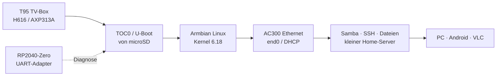
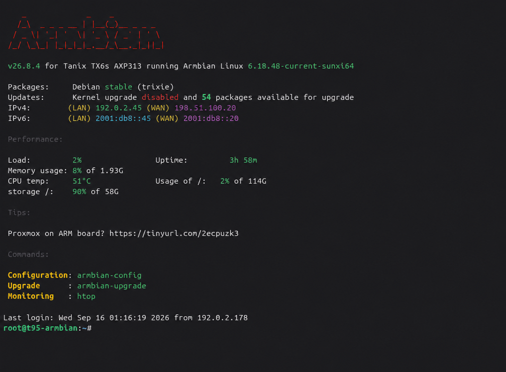
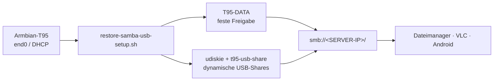

# T95 TV-Box → Armbian Linux Home Server


Ein reproduzierbarer Umbau, der eine **T95-TV-Box mit Allwinner H616**
in einen kleinen, stromsparenden **Armbian-Linux-Home-Server** verwandelt.
Der Schwerpunkt liegt auf nachvollziehbarem Boot- und Hardware-Bring-up,
Ethernet, UART-Diagnose und dokumentierten technischen Anpassungen.

> [!NOTE]
> **Privates Hardwareprojekt:** Ausgangspunkt war eine T95-TV-Box mit einer
> als BadBox-belastet beziehungsweise -verdächtig eingestuften Android-
> Installation. Deshalb wurde die Box nicht weiter als vertrauenswürdiges
> TV-Gerät verwendet. Ziel dieses privaten Projekts war es, die vorhandene
> Hardware ohne Nutzung des ursprünglichen Android-Systems als kleinen
> Armbian-Linux-Home-Server weiterzuverwenden. Dieser Umbau war erfolgreich;
> das geprüfte Ergebnis bootet von microSD und stellt Ethernet, SSH und
> optionale Samba-Dateifreigaben bereit.

> [!WARNING]
> Dieses Projekt ist für genau die geprüfte Platine gedacht:
> `H616-T95MAX-AXP313A-V3.0`. Der Aufdruck „T95“ beschreibt keine
> einheitliche Hardware. Eine ähnlich aussehende Box darf das Image erst nach
> eigener Platinen-, UART- und Bootprüfung verwenden.

> [!NOTE]
> **Projektstatus:** Der dokumentierte Stand ist auf der geprüften Platine
> `H616-T95MAX-AXP313A-V3.0` stabil getestet. Boot, sauberes Herunterfahren,
> SSH und Dateizugriff wurden im praktischen Betrieb ohne beobachtete Fehler
> geprüft. Das ist keine Zusage für andere T95-Varianten oder für noch nicht
> getestete Langzeit- und Peripheriefunktionen.

## Hardware-Fotos

Die folgenden Fotos zeigen die tatsächlich geprüfte T95-Platine und das
Gehäuse. Sie stehen bewusst früh in der README, damit die Hardware vor dem
Download des Images visuell mit dem eigenen Gerät verglichen werden kann.
Sie dienen der Zuordnung und ersetzen keine elektrische Prüfung. EXIF-/GPS-
Daten wurden entfernt; der individuelle MAC-/Barcode-Aufkleber ist abgedeckt.

<p>
  
  
  
  
</p>

## Inhaltsübersicht

- [Projektziel](#projektziel)
- [Endanwender-Schnellstart](#endanwender-schnellstart)
- [Armbian-Standard und T95-Anpassungen](#armbian-standard-und-t95-anpassungen)
- [Vollständiges Änderungsinventar](docs/CHANGES_FROM_ARMBIAN.md)
- [Geprüfte Hardware und Software](#geprüfte-hardware-und-software)
- [Nachgewiesener Stand](#nachgewiesener-stand)
- [eMMC als internes Datenlaufwerk](#emmc-als-internes-datenlaufwerk)
- [Hardware-Fotos](#hardware-fotos)
- [Technische Detailreferenz: Image-Personalisierung und SD-Schreiben](#technische-detailreferenz-image-personalisierung-und-sd-schreiben)
- [SD-Backup und Wiederherstellung](#sd-backup-und-wiederherstellung)
- [Samba- und USB-Dateiserver](#samba--und-usb-dateiserver)
- [UART-Diagnose mit RP2040-Zero](#uart-diagnose-mit-rp2040-zero)
- [Kernel- und DTB-Schutz](#kernel--und-dtb-schutz)
- [Sicherheitsgrenzen](#sicherheitsgrenzen)
- [Projektstruktur](#projektstruktur)
- [Reproduzierbarer Build und Release](#reproduzierbarer-build-und-release)
- [Optionale Weiterentwicklung](#optionale-weiterentwicklung)
- [Lizenz](#lizenz)

## Projektziel



Das Repository dokumentiert nicht nur ein fertiges Image, sondern die Schritte,
mit denen der Start reproduziert und im Fehlerfall zurückverfolgt werden kann:

1. Platine identifizieren und UART anschließen.
2. T95-spezifischen TOC0-/U-Boot-Loader auf microSD testen.
3. Armbian mit passendem DTB und AC300-Ethernet starten.
4. Erststart, Netzwerk und Stabilität prüfen.
5. Samba-/USB-Dateiserver reproduzierbar einrichten.
6. Ein generisches Release-Image lokal mit eigenem Zugang personalisieren.

## Endanwender-Schnellstart

> [!TIP]
> **Dieser Abschnitt ist für Endanwender gedacht.** Du musst weder U-Boot
> kompilieren noch ein Kernel- oder DTB-Image bauen. Lade das geprüfte
> Release-Image herunter, personalisiere es lokal und schreibe es auf eine
> microSD-Karte. Die technischen Portierungsdetails folgen weiter unten.

### Voraussetzungen

- eine T95 mit der geprüften Platine `H616-T95MAX-AXP313A-V3.0`;
- eine entbehrliche microSD-Karte (mindestens so groß wie das Release-Image);
- ein Linux-PC mit `bash`, `sudo`, `xz`, `sha256sum`, `lsblk`, `dd` und `e2fsck`;
- alternativ Windows 10/11 mit WSL2 sowie funktionierendem USB-/Blockgeräte-
  Passthrough. Für SD-Schreiben wird natives Linux ausdrücklich empfohlen;
- ein Netzwerkkabel zum Router und optional eine USB-Festplatte für Dateien.

> [!CAUTION]
> Alle Schreibbefehle überschreiben die ausgewählte SD-Karte vollständig.
> `/dev/sdX` ist **nur ein Platzhalter** und muss vor jedem Schreibvorgang
> durch das aktuell mit `lsblk` ermittelte SD-Gerät ersetzt werden. Niemals
> eine interne NVMe-, System- oder sonstige Festplatte auswählen.

### 1. Release herunterladen und prüfen

Lade aus dem [GitHub-Release](https://github.com/Web-Developer-DB/t95-tvbox-to-armbian-home-server/releases)
das Image und `SHA256SUMS` in denselben Ordner. Prüfe dort:

```bash
sha256sum -c SHA256SUMS
```

Nur bei einer erfolgreichen Prüfung fortfahren.

### 2. Persönliche lokale Image-Kopie erzeugen

Das öffentliche Image enthält absichtlich kein verwendbares Standardpasswort.
Erzeuge deshalb eine lokale Kopie mit einem eigenen Passwort. Das Passwort
bleibt außerhalb des Repositorys und wird nicht in GitHub veröffentlicht.

```bash
export REPO=/pfad/zum/t95-tvbox-to-armbian-home-server
export DOWNLOAD=/pfad/zum/GitHub-Release-Download
mkdir -p "$HOME/t95-private"

xz -dk --keep \
  "$DOWNLOAD/T95-H616-AXP313A-Armbian-26.8.4-6.18.48-v1.0.0.img.xz"

bash "$REPO/tools/provision-t95-release-image.sh" \
  "$DOWNLOAD/T95-H616-AXP313A-Armbian-26.8.4-6.18.48-v1.0.0.img" \
  "$HOME/t95-private/t95-personal.img" \
  PROVISION-T95-ROOT-PASSWORD
```

### 3. SD-Karte ermitteln und Image schreiben

SD-Karte einstecken und die Ausgabe unmittelbar vor dem Schreiben prüfen:

```bash
lsblk -b -o NAME,SIZE,MODEL,SERIAL,TRAN,RM,TYPE,MOUNTPOINTS
```

Das Ziel muss eine wechselbare USB-Karte (`RM=1`) sein. Danach `/dev/sdX`
im folgenden Befehl durch den **tatsächlichen** Gerätenamen ersetzen:

```bash
bash "$REPO/tools/write-t95-provisioned-image-to-sd.sh" \
  /dev/sdX \
  "$HOME/t95-private/t95-personal.img" \
  "$HOME/t95-private/t95-personal.img.t95-provisioned-manifest" \
  WRITE-T95-PROVISIONED-TO-SDX
```

Das Werkzeug hängt die Partitionen aus, schreibt das Image, liest es zurück
und prüft Hash, TOC0-Loader und ext4. Die Karte darf erst nach `ERFOLG`
entfernt werden.

### 4. T95 starten und per SSH anmelden

1. T95 vollständig ausschalten.
2. Die geprüfte microSD einsetzen und Ethernet mit dem Router verbinden.
3. T95 einschalten und im Router die neue DHCP-Adresse ablesen.
4. Per SSH verbinden, zum Beispiel `ssh root@<T95-IP>`.
5. Den Armbian-Ersteinrichtungsdialog abschließen und ein starkes Passwort
   verwenden.

Die Box bootet im unterstützten Releaseweg von microSD. Die interne eMMC wird
hierbei nicht verändert.

### 5. Kernel und DTB vor Updates schützen

> [!IMPORTANT]
> Dieser geprüfte T95-Aufbau verwendet Kernel `6.18.48` und ein passendes
> T95-DTB. Vor allgemeinen Systemupdates müssen die beiden Kernelpakete
> eingefroren werden. Sonst kann ein späteres Kernel- oder DTB-Update die
> Bootfähigkeit oder die AC300-Ethernet-Unterstützung verändern.

Direkt nach dem Armbian-Ersteinrichtungsdialog und **vor** `apt upgrade`,
`apt full-upgrade` oder der Samba-Installation ausführen:

```bash
sudo apt-mark hold linux-image-current-sunxi64 linux-dtb-current-sunxi64
apt-mark showhold
uname -r
```

Erwartet werden beide Paketnamen unter `apt-mark showhold` und die Version
`6.18.48-current-sunxi64` bei `uname -r`. Normale Debian-/Armbian-Pakete
dürfen danach weiterhin aktualisiert werden; die Kernel-/DTB-Pakete bleiben
jedoch geschützt. Ein bewusst geplantes Kernelupdate ist nur nach Backup und
mit der Anleitung im Abschnitt [Kernel- und DTB-Schutz](#kernel--und-dtb-schutz)
vorzunehmen.

### 6. Optional: Dateien über USB/Samba freigeben

Nach erfolgreicher SSH-Anmeldung kann das optionale Modul
[`server/samba-usb/`](server/samba-usb/) installiert werden. Es richtet Samba,
USB-Automount und eine geschützte Dateifreigabe ein. Die vollständige
Endanwender-Anleitung steht in
[`server/samba-usb/README.md`](server/samba-usb/README.md).

Der Unterschied zu einer normalen Samba-Installation über die Distribution:
Standard-Samba stellt vor allem den SMB-Dienst bereit. Dieses optionale Modul
ergänzt ihn um die T95-spezifische feste Freigabe `T95-DATA`, automatisches
Einbinden neuer USB-Sticks oder USB-Festplatten und eine eigene dynamische
SMB2/SMB3-Freigabe pro angeschlossenem Medium. Der Freigabename wird aus dem
Laufwerkslabel abgeleitet; beim Entfernen und Wiedereinstecken werden die
Freigaben automatisch aktualisiert. Dadurch ist keine manuelle
`smb.conf`-Änderung für jedes USB-Laufwerk erforderlich.

### 7. Backup erstellen

Nach der Ersteinrichtung zuerst ein vollständiges SD-Backup auf dem PC anlegen.
Die sichere Schrittfolge steht in [`docs/BACKUP.md`](docs/BACKUP.md). Backups
enthalten persönliche Daten und gehören nicht in GitHub.

> [!NOTE]
> Wenn die Box nicht startet oder keine DHCP-Adresse erhält, nicht sofort ein
> anderes Image schreiben. Zuerst die [UART-Diagnose](#uart-diagnose-mit-rp2040-zero)
> sowie die [technische Detailreferenz](#technische-detailreferenz-image-personalisierung-und-sd-schreiben)
> verwenden.

## Armbian-Standard und T95-Anpassungen

Als Ausgangspunkt dient ein offizielles Armbian-Image für die verwandte
Tanix-TX6s-/AXP313-Plattform: Armbian 26.8.4, Debian 13 Trixie und Kernel
`6.18.48-current-sunxi64`. Kernel, Initramfs und das Debian-Root-Dateisystem
werden im nachgewiesenen T95-6.18-Aufbau weitgehend unverändert übernommen.
Die Bootfähigkeit entsteht durch eine zusätzliche, hardware­spezifische
Bootkette:

| Bestandteil | Armbian-Ausgangsstand | T95-Projektänderung | Bei anderer Box zuerst prüfen |
| --- | --- | --- | --- |
| Kernel und Rootfs | vorhanden, funktionierender Standard | kein Kernel-Neubau im finalen 6.18-Aufbau | Kernelversion und Treiberbestand beibehalten |
| U-Boot / TOC0 | generischer Board-Bootpfad | eigener T95-Loader, SD-Laden von `mmc 0:1`, TOC0 bei Byte 8192 | SoC, DRAM, PMIC und Boot-ROM-Vertrag |
| TF-A / BL31 | passend zum Ausgangsboard | mit dem T95-U-Boot gepaarte TF-A-Version | SoC-/Boardvariante und BL31-Kompatibilität |
| DTB | Tanix-TX6s-/AXP313-DTB | T95-kompatibler Name und AC300-/RMII-Beschreibung | tatsächliche Platine, PHY-Adresse, MDIO und Taktpfad |
| `armbianEnv.txt` | generische DTB-/Bootauswahl | T95-DTB, serielle Konsole, ext4-Root und Diagnoseparameter | nur die wirklich belegten Gerätewerte ändern |
| AC300-Ethernet | nicht für jede T95-Revision garantiert | DTB-/U-Boot-Vorinitialisierung für `end0` | PHY, Reset, Clock, MAC und Link separat messen |
| `clk_ignore_unused nohz=off` | nicht erforderlich | vorläufige Diagnose-/Stabilitätshilfe | nach erfolgreichem Boot wieder unabhängig testen |
| Sicherheits-Härtung | nicht Teil des Rohimages | Root sperren, Hostkeys entfernen, neue Hostkeys vor `sshd` erzeugen | Zugangsdaten immer lokal personalisieren |
| Samba und USB-Shares | nicht Teil des Minimalimages | separates Modul unter `server/samba-usb/` | erst nach stabilem Linux- und Netzwerkstart |

Für diese Platine ist daher **nur das Austauschen des DTB nicht ausreichend**:
Ein ungeeigneter U-Boot-/TOC0-Loader kann bereits vor dem Kernel hängen bleiben.
Umgekehrt muss für einen reinen Kernel- oder Userspace-Fehler nicht sofort die
gesamte Armbian-Basis geändert werden. Die bewährte Reihenfolge ist:

1. **Kein U-Boot-Banner:** zuerst Loader, TOC0-Offset, SD-Layout und UART prüfen.
2. **U-Boot startet, DRAM/PMIC scheitert:** nur DRAM-, AXP313- oder Boardparameter
   des Loaders untersuchen.
3. **Kernel startet, aber bleibt früh hängen:** DTB, Kernelversion und
   `armbianEnv.txt` vergleichen; Rootfs zunächst unverändert lassen.
4. **Linux läuft, Ethernet fehlt:** AC300-/PHY-Knoten, RMII, Reset und Clock
   prüfen; Samba oder eMMC sind dafür nicht relevant.
5. **Linux und Netzwerk laufen:** erst dann optionale Schichten wie Samba,
   USB-Automount und eMMC-Datenablage einrichten.

Diese Trennung erleichtert Portierungen: Für eine ähnliche Platine werden
zunächst Kernel und Rootfs aus dem passenden Armbian-Image übernommen und nur
die nachweislich boardabhängigen Teile angepasst. Änderungen am Kernel oder am
Rootfs sind erst dann gerechtfertigt, wenn UART-Log und DTB-Prüfung zeigen,
dass die Bootkette bereits funktioniert.

Die vollständige Zuordnung von Armbian-Ausgangspunkt, Patch, Build-Skript,
Resultat, Portierungsprüfung und Nachweis steht im
[Änderungsinventar](docs/CHANGES_FROM_ARMBIAN.md). Dort sind auch die bewusst
unveränderten Bestandteile und die Pflegeanforderungen für neue Armbian-Releases
festgehalten.

## Geprüfte Hardware und Software

| Bereich | Nachgewiesene Konfiguration |
| --- | --- |
| Platine | `H616-T95MAX-AXP313A-V3.0` |
| SoC | Allwinner H616, 4 × Cortex-A53 |
| PMIC | AXP313A |
| Arbeitsspeicher | 2 GiB DRAM |
| Ethernet | Allwinner AC300 EPHY, RMII, 100 Mbit/s Full Duplex |
| Systemmedium | 128-GB-microSD (`/dev/mmcblk0`) |
| Interner Speicher | ca. 32-GB-eMMC (`/dev/mmcblk2`), Lesen/Schreiben geprüft; als ext4-Datenlaufwerk nutzbar |
| Distribution | Armbian 26.8.4, Debian 13 Trixie |
| Kernel | `6.18.48-current-sunxi64` |
| DTB | `sun50i-h616-t95-axp313-tanix-6.18.dtb` |
| Bootmedium | microSD, TOC0-Loader ab Byte 8192 |

## Nachgewiesener Stand

| Test | Ergebnis | Hinweis |
| --- | :---: | --- |
| SD-Boot mit eigenem TOC0-/U-Boot | ✅ | eMMC bleibt dabei unverändert |
| DRAM-Initialisierung | ✅ | 2 GiB erkannt |
| Ethernet / DHCP / SSH | ✅ | `end0`, 100 Mbit/s, IPv4/IPv6 und DNS getestet |
| Endanwender-Start | ✅ | Start aus ausgeschaltetem Zustand von microSD geprüft |
| Sauberes Herunterfahren | ✅ | kontrolliertes Herunterfahren im Betrieb geprüft |
| Dateizugriff | ✅ | Dateien über den eingerichteten Serverpfad erreichbar |
| eMMC als ext4-Datenlaufwerk | ✅ | interner Speicher funktioniert als Datenmedium; Einbindung ist installationsabhängig |
| Armbian-Boot von eMMC | ❌ | Installations-/Bootversuch fehlgeschlagen; microSD bleibt der unterstützte Bootweg |
| CPU-Dauerlast | ✅ | 4 Worker, 10 Minuten, ca. 62 °C maximal |
| microSD-I/O | ✅ | etwa 22–23 MB/s Lesen und 21,5 MB/s Schreiben |
| eMMC-I/O | ✅ | ca. 63,8–77,4 MB/s Lesen; Schreiben für diesen Stand nicht belastbar gemessen |
| eMMC-Gesundheit | ✅ | Life Time A/B und Pre-EOL jeweils `0x01` |
| WLAN / Bluetooth / GPU / Audio | ⚠️ | für den headless Server nicht erforderlich bzw. unvollständig |
| Samba `T95-DATA` | ✅ | authentifizierte SMB2/SMB3-Freigabe getestet |
| USB-Automount und dynamische Usershares | ✅ | Label-/Fallback-Namen, Auswurf und Wiedereinstecken getestet |
| VLC-Wiedergabe über SMB | ✅ | lokale Netzwerk-Wiedergabe erfolgreich geprüft |

Die Samba-/USB-Ausbaustufe sowie die Endanwender-Abnahme mit Start,
Herunterfahren und Dateizugriff sind damit bestanden. Langzeitmessungen,
weitere Peripherie und eine endgültige Kernel-/Timer-Konfiguration bleiben
optionale Weiterentwicklungen und ändern den stabil getesteten Grundstand
nicht.

## eMMC als internes Datenlaufwerk

Die T95 besitzt neben dem microSD-Steckplatz einen internen eMMC-Speicher. Unter
Armbian wird er als `/dev/mmcblk2` mit einer nutzbaren Kapazität von etwa
29,1 GiB erkannt (entspricht nominell 32 GB). Die vom eMMC-Standard
bereitgestellten Bootbereiche sind ebenfalls vorhanden:

```text
/dev/mmcblk2boot0   4 MiB
/dev/mmcblk2boot1   4 MiB
```

Für den Serverbetrieb wurde der Nutzbereich als eigene ext4-Datenpartition
eingerichtet:

```text
/dev/mmcblk2p1   ext4   Label: T95-DATA   Mountpoint: /srv/T95-DATA
```

Die konkrete UUID wird absichtlich nicht dokumentiert. Sie gehört zur jeweils
verwendeten eMMC-Partition und muss bei einer eigenen Einrichtung mit
`blkid` bzw. `findmnt` ermittelt werden.

### Leistung und Verschleiß

Die protokollierten sequenziellen Lesetests ergaben:

| Medium / Test | Ergebnis |
| --- | ---: |
| eMMC, direkter Lesetest | ca. 77,4 MB/s |
| eMMC, `hdparm` | ca. 63,8 MB/s |
| microSD, Lesen | ca. 23,4 MB/s |
| microSD, Schreiben | ca. 21,5 MB/s |

Damit liest die eMMC ungefähr drei Mal schneller als die verwendete microSD.
Ein belastbarer eMMC-Schreibwert liegt für diesen Versuchsstand nicht vor und
wird deshalb nicht angegeben.

Die eMMC-Health-Register wurden mit `mmc-utils` geprüft:

```text
DEVICE_LIFE_TIME_EST_TYP_A = 0x01
DEVICE_LIFE_TIME_EST_TYP_B = 0x01
PRE_EOL_INFO               = 0x01
```

`0x01` steht bei den beiden Lifetime-Feldern für etwa 0–10 % der
spezifizierten Lebensdauer und beim Pre-EOL-Feld für einen normalen Zustand.
Die getestete eMMC zeigte somit keinen nennenswerten Verschleiß. Diese
Hersteller-Schätzwerte ersetzen keine Backups und sind keine Garantie für die
zukünftige Lebensdauer.

### Bootstrategie

Ein vollständiger Armbian-Start von der eMMC wurde versucht, war mit dem
generischen eMMC-Bootloader auf dieser konkreten H616-/AXP313A-Platine jedoch
nicht zuverlässig möglich. Das Problem lag im Bootpfad, nicht an der
Dateisystem- oder eMMC-Gesundheit. Der reproduzierbare Stand verwendet daher:

```text
microSD  → TOC0-/U-Boot und Armbian-System
eMMC     → dauerhaftes ext4-Datenlaufwerk (T95-DATA)
```

Diese Aufteilung verändert die Android-eMMC nicht automatisch und macht sie
nicht bootfähig. Sie bietet trotzdem eine schnelle interne Ablage für Backups,
Samba-Dateien und andere Serverdaten.

Im öffentlichen SD-Release wird die interne eMMC nicht beschrieben. Wer sie
wie im geprüften Aufbau als Datenlaufwerk verwenden möchte, muss Partitionierung,
Formatierung und Einbindung bewusst selbst durchführen und vorher ein eigenes
Backup anlegen.

Das integrierte Ethernet ist auf 100 Mbit/s begrenzt; gemessen wurden etwa
94,5 Mbit/s beziehungsweise ungefähr 11–12 MB/s Nutzdaten pro Sekunde. Bei
Samba-Zugriffen ist daher das Netzwerk und nicht die eMMC der limitierende
Faktor.

## Beispiel einer erfolgreichen SSH-Sitzung

### SSH-Statusansicht

Die folgende anonymisierte Sitzung zeigt den erfolgreichen Armbian-Start und
die verfügbaren Systeminformationen nach der SSH-Anmeldung. Netzwerkadressen,
der letzte Login-Absender und der lokale Hostname wurden durch
Dokumentationswerte ersetzt.



> [!NOTE]
> **Datenschutz-Hinweis:** Das Bild basiert auf einer echten SSH-Sitzung des
> getesteten Systems, ist für die Veröffentlichung aber sichtbar bereinigt.
> LAN-/WAN-Adressen, IPv6-Adressen, der letzte Login-Absender und der lokale
> Hostname wurden durch neutrale Dokumentationswerte ersetzt. Es handelt sich
> daher nicht um eine unveränderte Live-Aufnahme.

## Technische Detailreferenz: Image-Personalisierung und SD-Schreiben

> [!NOTE]
> Dieser Abschnitt beschreibt die technischen Schritte für Image-
> Personalisierung, SD-Schreiben und Anpassungen. Für die normale Installation
> genügt der [Endanwender-Schnellstart](#endanwender-schnellstart) am Anfang.

> [!IMPORTANT]
> Das öffentliche Image ist absichtlich generisch: Root ist gesperrt und es
> enthält keine privaten SSH-Hostschlüssel. Vor dem Schreiben wird lokal eine
> persönliche Kopie mit eigenem Passwort erzeugt.

### Ausführungsumgebung: Linux oder WSL2

Alle Befehle und Bash-Skripte in diesem Repository sind für eine **Linux-
Shell** geschrieben. Empfohlen wird ein aktuelles Ubuntu- oder Debian-System
mit `bash`, `sudo`, `xz`, `sha256sum`, `lsblk` und den üblichen Dateisystem-
Werkzeugen.

Unter Windows kann alternativ **WSL2** mit Ubuntu oder Debian verwendet werden.
Dabei gelten wichtige Einschränkungen:

- PowerShell und die klassische Windows-Eingabeaufforderung sind für diese
  Befehle nicht geeignet.
- Für UART-, FEL- und USB-Tests muss das Gerät per USB-Passthrough (z. B.
  `usbipd-win`) in WSL sichtbar sein.
- Für direkte SD-Schreibzugriffe muss die Karte in WSL als Linux-Blockgerät
  `/dev/sdX` erscheinen und mit den erforderlichen Rechten erreichbar sein.
- Ist USB- oder Blockgeräte-Passthrough nicht zuverlässig eingerichtet, sollte
  der jeweilige Hardware-Schritt auf einem nativen Linux-System ausgeführt
  werden. Besonders wichtig ist die Kontrolle von `lsblk`, bevor ein
  Schreibwerkzeug gestartet wird.

Die folgenden Beispiele verwenden deshalb bewusst Linux-Pfade, `sudo` und
Bash-Syntax. Windows-Pfade wie `C:\\...` werden nicht direkt eingesetzt.

> [!TIP]
> **Native Linux-Installation wird empfohlen.** Sie vermeidet die zusätzliche
> Geräte- und Rechte-Schicht von Windows/WSL2 und ist für SD-, FEL- und UART-
> Tests am zuverlässigsten.

### Warum natives Linux bevorzugt wird

| Aufgabe | Native Linux | Windows / WSL2 |
| --- | --- | --- |
| Bash-Skripte | direkt ausführbar | nur innerhalb WSL2 |
| SD-Karte | `/dev/sdX` mit `lsblk` direkt sichtbar | Blockgerät muss eigens durchgereicht werden |
| Image schreiben | `dd`, `sync` und Rücklesen direkt möglich | Windows-Mounts und Laufwerksmapping können stören |
| UART mit RP2040-Zero | `/dev/ttyACM*` direkt verfügbar | meist als COM-Port sichtbar, WSL übernimmt ihn nicht automatisch |
| FEL / `sunxi-tools` | USB-Gerät direkt verfügbar | USB-Passthrough, z. B. `usbipd-win`, notwendig |
| `udev` / `sudo` | nativ unterstützt | in WSL2 teilweise eingeschränkt |
| Fehlerrisiko beim SD-Schreiben | gut kontrollierbar | höher durch wechselnde Laufwerkszuordnung |

Die Windows-Variante ist möglich, aber nicht gleichwertig: Ein falsch
zugeordnetes Blockgerät kann zum Schreiben auf die falsche Festplatte führen.
Deshalb muss `lsblk` unmittelbar vor jedem SD-Schreibvorgang geprüft werden.

### Wenn Windows trotzdem verwendet wird

| Aufgabe | Empfohlene Umgebung |
| --- | --- |
| Repository-Checks, `sha256sum`, Build- und Image-Skripte | WSL2 (Ubuntu/Debian) |
| RP2040-Zero-UART-Konsole und Live-Ausgabe | Windows PowerShell bzw. ein Windows-Seriellmonitor am COM-Port |
| Direkter SD-Schreibzugriff | bevorzugt natives Linux; unter WSL2 nur mit funktionierendem Blockgeräte-Passthrough |

Der RP2040-Zero wird unter Windows normalerweise als COM-Port erkannt. Für die
UART-Konsole kann daher ein separates PowerShell-Fenster oder ein kompatibler
Windows-Seriellmonitor mit **115200 Baud, 8N1 und ohne Flow-Control** verwendet
werden. WSL2 übernimmt diesen COM-Port nicht automatisch. Soll die UART-
Aufzeichnung stattdessen mit dem Linux-Skript erfolgen, muss der USB-/COM-Port
explizit an WSL2 durchgereicht werden; beide Programme dürfen den Port nicht
gleichzeitig öffnen.

### 1. Release-Dateien prüfen

Aus dem GitHub-Release herunterladen und im Download-Verzeichnis prüfen:

```bash
sha256sum -c SHA256SUMS
```

Das Release-Image heißt:

```text
T95-H616-AXP313A-Armbian-26.8.4-6.18.48-v1.0.0.img.xz
```

### 2. Lokale Image-Kopie personalisieren

Das folgende Werkzeug läuft auf dem Linux-PC und schreibt nur eine lokale
Kopie. Das Passwort wird nicht in einem Manifest oder im Repository abgelegt.

```bash
export REPO=/pfad/zum/t95-tvbox-to-armbian-home-server
export DOWNLOAD=/pfad/zum/GitHub-Release-Download
mkdir -p "$HOME/t95-private"

xz -dk --keep \
  "$DOWNLOAD/T95-H616-AXP313A-Armbian-26.8.4-6.18.48-v1.0.0.img.xz"

bash "$REPO/tools/provision-t95-release-image.sh" \
  "$DOWNLOAD/T95-H616-AXP313A-Armbian-26.8.4-6.18.48-v1.0.0.img" \
  "$HOME/t95-private/t95-personal.img" \
  PROVISION-T95-ROOT-PASSWORD
```

Die persönliche `.img`-Datei und die zugehörige
`.t95-provisioned-manifest`-Datei bleiben außerhalb von GitHub.

### 3. SD-Karte eindeutig bestimmen

> [!CAUTION]
> In allen folgenden Befehlen ist `/dev/sdX` nur ein Platzhalter. `X` muss
> durch den **tatsächlichen Gerätenamen deiner SD-Karte** ersetzt werden, zum
> Beispiel `/dev/sda` oder `/dev/sdb`. Diesen Namen unmittelbar vorher mit
> `lsblk` ermitteln. Die Kennzeichnung `SDX` in einem Bestätigungstoken wie
> `WRITE-T95-PROVISIONED-TO-SDX` bleibt dagegen unverändert, sofern das
> Skript sie genau so verlangt.

Nach jedem Einstecken den Gerätenamen neu prüfen. Niemals blind `/dev/sda`
verwenden:

```bash
lsblk -b -o NAME,SIZE,MODEL,SERIAL,TRAN,RM,TYPE,MOUNTPOINTS
```

Das Ziel muss eine entbehrliche, wechselbare microSD-Karte (`RM=1`) sein.

### 4. Persönliches Image schreiben

Das Werkzeug prüft Gerätekennung, Manifest, Image-Hash und liest die Karte
nach dem Schreiben zurück. Die interne eMMC wird nicht angesprochen.

```bash
bash "$REPO/tools/write-t95-provisioned-image-to-sd.sh" \
  /dev/sdX \
  "$HOME/t95-private/t95-personal.img" \
  "$HOME/t95-private/t95-personal.img.t95-provisioned-manifest" \
  WRITE-T95-PROVISIONED-TO-SDX
```

### 5. Kaltstart und Ersteinrichtung

1. SD-Karte nur bei ausgeschalteter T95 einsetzen.
2. Ethernet mit dem Router verbinden.
3. T95 einschalten und die DHCP-Lease im Router ablesen.
4. Per SSH anmelden und den Armbian-Ersteinrichtungsdialog abschließen.

Es gibt kein veröffentlichtes Standardpasswort. Beim ersten Start werden
eigene SSH-Hostschlüssel erzeugt, bevor `sshd` Verbindungen annimmt.

## SD-Backup und Wiederherstellung

Vor Kernel-, DTB- oder Serveränderungen sollte ein vollständiges Abbild der
laufenden SD-Karte erstellt werden. Die Anleitung in
[`docs/BACKUP.md`](docs/BACKUP.md) liest das komplette wechselbare Gerät,
prüft das komprimierte Archiv per zstd und SHA-256 und beschreibt die
Wiederherstellung auf eine gleich große Ersatzkarte.

> [!CAUTION]
> Ein Vollbackup enthält Konten, SSH-/Samba-Konfiguration und möglicherweise
> weitere persönliche Daten. Es bleibt lokal oder auf einem geschützten
> Zweitdatenträger und wird nicht als GitHub-Release veröffentlicht.

Kurzablauf:

```text
Box sauber herunterfahren → SD-Gerät mit lsblk prüfen → Partitionen aushängen
→ vollständiges /dev/sdX-Image lesen → zstd- und SHA-256-Prüfung
→ bei Bedarf nur auf eine geprüfte Ersatz-SD zurückschreiben
```

Die interne Android-eMMC wird durch den SD-Backup-Weg weder gelesen noch
beschrieben. Für den geprüften Aufbau kann die eMMC separat als
ext4-Datenlaufwerk eingebunden werden; sie ist dadurch nicht automatisch ein
bootfähiges Armbian-System.

## Samba- und USB-Dateiserver

Die T95 kann nach dem Armbian-Erststart als kleiner, stromsparender Datei- und
Medienserver betrieben werden. Das Modul in
[`server/samba-usb/`](server/samba-usb/) richtet eine feste interne Freigabe
`T95-DATA` und automatisch je eine eigene Freigabe für jedes eingesteckte
USB-Laufwerk ein.



> [!IMPORTANT]
> Die Installation wird auf der laufenden T95-Armbian-Box ausgeführt, nicht
> auf dem Build-PC. Ein bestehender Linux-Benutzer wird als `T95_USER`
> übergeben; das Samba-Passwort wird interaktiv gesetzt und nicht im
> Repository gespeichert.

Schnellpfad nach der SSH-Anmeldung:

```bash
cd /pfad/zum/checkout/server/samba-usb
sha256sum -c MANIFEST.sha256
sudo T95_USER=serveruser ./scripts/restore-samba-usb-setup.sh
```

Danach USB-Datenträger einstecken und die Freigaben prüfen:

```bash
sudo -u serveruser net usershare list
```

Vom Client aus ist die Serverwurzel der bevorzugte Einstieg:
`smb://<SERVER-IP>/` (unter Windows auch `\\<SERVER-IP>\\`). Eine
ausführliche, reproduzierbare Anleitung mit Voraussetzungen, Erfolgskriterien,
VLC-Beispiel, sicherem Auswurf und Fehlerdiagnose steht in
[`server/samba-usb/README.md`](server/samba-usb/README.md).

> [!CAUTION]
> Das Restore-Skript sichert eine vorhandene `/etc/samba/smb.conf` mit
> Zeitstempel und ersetzt sie anschließend durch die bekannte
> Projektkonfiguration. Vor dem Einsatz auf einem produktiven Samba-Server
> zuerst die Sicherung und die [technische Dokumentation](server/samba-usb/docs/SAMBA-USB-SETUP.md)
> prüfen.

## UART-Diagnose mit RP2040-Zero

Für Bootaufzeichnungen wurde ein **RP2040-Zero** als externer USB-zu-TTL-
UART-Adapter verwendet. Das separate Firmware- und Verdrahtungsprojekt steht
hier:

[Web-Developer-DB/rp2040-zero-uart-adapter](https://github.com/Web-Developer-DB/rp2040-zero-uart-adapter)

Elektrische Eckdaten:

| RP2040-Zero | T95 |
| --- | --- |
| `GP0` (TX) | T95-RX |
| `GP1` (RX) | T95-TX |
| `GND` | gemeinsame Masse |

* 3,3-V-TTL, 115200 Baud, 8N1 verwenden.
* 5-V-TTL und echtes RS-232 niemals direkt anschließen.
* Für reine Bootaufzeichnung kann die TX-Leitung des Adapters getrennt bleiben.
* Capture-Dateien können persönliche Daten enthalten und werden nicht
  veröffentlicht.

Beispiel für eine Aufzeichnung:

```bash
python3 tools/capture_uart.py /dev/ttyACM1 \
  --baud 115200 \
  --duration 240 \
  --prefix captures/d95-coldboot
```

## Kernel- und DTB-Schutz

Die geprüfte Kernel-/DTB-Kombination sollte nach der Ersteinrichtung nicht
ungefragt durch ein Paketupdate ersetzt werden:

```bash
sudo apt-mark hold linux-image-current-sunxi64 linux-dtb-current-sunxi64
apt-mark showhold
uname -r
```

Vor einem bewusst geplanten Update zuerst ein vollständiges Backup erstellen,
UART bereithalten und die Sperre gezielt aufheben:

```bash
sudo apt-mark unhold linux-image-current-sunxi64 linux-dtb-current-sunxi64
sudo apt update
sudo apt full-upgrade
```

Danach DTB, AC300-Ethernet, Kaltstart und Netzwerk erneut prüfen. Die Sperre ist
eine Schutzmaßnahme für den nachgewiesenen Stand, kein Ersatz für
Sicherheitsupdates oder Backups.

## Sicherheitsgrenzen

> [!CAUTION]
> Dieses Projekt entfernt oder bereinigt die Android-eMMC nicht automatisch.
> Ein möglicher BADBOX-Befund der alten Firmware wird weder übernommen noch
> als Vertrauensquelle verwendet.

- Der normale Release-Weg startet von microSD und beschreibt die eMMC nicht.
- Vor jedem SD-Schreibvorgang Gerät, Größe, Seriennummer und `RM=1` prüfen.
- Loader, DTB und Root-Dateisystem nur mit dokumentierten Werkzeugen ändern.
- Backups, UART-Captures, Artefakte, private Schlüssel und persönliche Images
  bleiben lokal und sind durch `.gitignore` ausgeschlossen.
- `clk_ignore_unused nohz=off` sind vorläufige Diagnoseparameter, keine
  endgültige Serverkonfiguration.

## Projektstruktur

| Pfad | Zweck |
| --- | --- |
| [`docs/RELEASE.md`](docs/RELEASE.md) | geprüfter Releaseweg und Grenzen |
| [`docs/VALIDATION.md`](docs/VALIDATION.md) | öffentliche Testmatrix und Hash-Nachweise |
| [`docs/PUBLISHING.md`](docs/PUBLISHING.md) | Veröffentlichungs- und Geheimnisprüfung |
| [`docs/GITHUB_RELEASE_NOTES.md`](docs/GITHUB_RELEASE_NOTES.md) | Textbausteine für ein GitHub-Release |
| [`docs/BACKUP.md`](docs/BACKUP.md) | vollständiges SD-Backup und Wiederherstellung |
| [`docs/CHANGES_FROM_ARMBIAN.md`](docs/CHANGES_FROM_ARMBIAN.md) | Datei-/Patch-Inventar gegenüber dem Armbian-Ausgangsstand |
| [`build/README.md`](build/README.md) | hostseitige Buildkette |
| [`build/patches/`](build/patches/) | versionierte T95-/AC300-Patches |
| [`tools/provision-t95-release-image.sh`](tools/provision-t95-release-image.sh) | lokale Passwort-Initialisierung |
| [`tools/write-t95-provisioned-image-to-sd.sh`](tools/write-t95-provisioned-image-to-sd.sh) | verifizierter SD-Schreiber |
| [`server/samba-usb/`](server/samba-usb/) | Samba- und USB-Automount für den Home-Server |
| [`docs/images/`](docs/images/) | bereinigte Hardware-Fotos |

## Reproduzierbarer Build und Release

Die Buildkette wird auf dem Linux-PC ausgeführt. Eine Übersicht steht in
[`build/README.md`](build/README.md). Der sichere Ablauf ist:

```text
Quelle vorbereiten → DTB/Rootfs bauen → Image härten →
Image auditieren → Release-Manifest erzeugen → lokal personalisieren → SD schreiben
```

Das generische Release-Image wird offline auf folgende Eigenschaften geprüft:

- Rootkonto gesperrt;
- keine privaten SSH-Hostschlüssel im Image;
- Hostschlüssel-Erzeugung vor dem Start von `sshd`;
- leere `machine-id`;
- bereinigte freie ext4-Blöcke;
- SHA-256-Prüfsummen für Image, Loader und DTB.

Das große Image gehört als Release-Asset zu GitHub, nicht in den Git-Verlauf.

## Optionale Weiterentwicklung

- ⏳ zusätzliche Langzeitmessungen und weitere Kaltstartserien
- ⏳ Entscheidung über eine endgültige Kernel-/Timer-Konfiguration
- ⏳ optionale Unterstützung für WLAN, Audio, HDMI und Fernbedienung

Diese Punkte sind nicht Voraussetzung für den dokumentierten Home-Server-Betrieb.

## Lizenz

Für dieses Repository ist derzeit absichtlich noch keine Lizenz festgelegt.
Vor einer Weiterveröffentlichung müssen die Lizenz des Projekts und die
Lizenzen aller übernommenen Upstream-Bestandteile geprüft werden.
