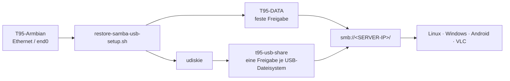

# T95 Samba + USB-Automount


Reproduzierbare Samba-/USB-Konfiguration für den als Armbian-Home-Server
betriebenen T95. Die Anleitung richtet sich an eine laufende T95-Armbian-Box,
nicht an den Linux-PC, auf dem das T95-Image gebaut wird.

## Ergebnis auf einen Blick



Die geprüfte Bedienung ist die Serverwurzel `smb://<SERVER-IP>/`. Dort werden
die interne Freigabe `T95-DATA` und alle aktuell eingesteckten USB-/SSD-
Freigaben gemeinsam angezeigt.

Es gibt absichtlich **keine** statische `[USB]`-Sammelfreigabe. Jedes Medium
zeigt dadurch seine echte Kapazität und den korrekten freien Speicherplatz.

## Was richtet das Samba-Modul ein?

Das Modul macht aus der laufenden T95 einen zugriffsgeschützten Dateiserver:

- `T95-DATA` ist eine feste Freigabe für den gewählten Speicherordner.
- USB-Sticks und USB-Festplatten werden automatisch eingebunden.
- Für jedes eingehängte USB-Dateisystem erscheint eine eigene Freigabe.
- Linux, Windows, Android und VLC greifen mit demselben Linux-/Samba-Konto zu.
- `usb-eject` wirft ein USB-Laufwerk kontrolliert aus, bevor es abgezogen wird.

Die festen Daten von `T95-DATA` und die dynamischen USB-Freigaben sind zwei
getrennte Dinge. Der Speicherpfad für `T95-DATA` wird bei der Einrichtung mit
`DATA_PATH` gewählt. USB-Laufwerke werden dagegen automatisch eingebunden und
brauchen keine manuelle Pfadänderung.

### Welchen Speicherort soll ich wählen?

| Ort | Beispiel für `DATA_PATH` | Wann passend? |
| --- | --- | --- |
| System-microSD | `/srv/t95-sd-data/Share` | Für kleine Datenmengen und einen einfachen Start. Viel Schreiben kann die SD-Karte stärker beanspruchen. |
| Interne eMMC | `/srv/T95-DATA/Share` | Empfohlen für regelmäßige oder größere Datenmengen, wenn die eMMC bereits dauerhaft an `/srv/T95-DATA` eingehängt ist. |
| USB-Laufwerk | Kein `DATA_PATH` nötig | USB-Speicher wird als eigene dynamische Freigabe automatisch hinzugefügt. |

Das Standardziel `/srv/T95-DATA/Share` setzt voraus, dass ein eMMC-Dateisystem
unter `/srv/T95-DATA` eingehängt ist. Ohne diesen Mount liegt der Ordner
stattdessen auf dem System-Dateisystem der SD-Karte. Soll die feste Freigabe
bewusst auf der SD-Karte liegen, wähle einen eigenen Ordner wie
`/srv/t95-sd-data/Share`. Wenn der eMMC-Pfad verwendet werden soll, muss die
eMMC zuerst eingerichtet, dauerhaft eingehängt und mit `findmnt` geprüft
werden. Das Samba-Skript formatiert, partitioniert oder verschiebt keine
vorhandenen Dateien.

### Getestete Referenzplattform

| Bereich | Referenz |
| --- | --- |
| Hardware | T95 `H616-T95MAX-AXP313A-V3.0` mit Allwinner AC300 Ethernet |
| System | Armbian 26.8.4, Debian 13 Trixie, Kernel 6.18 |
| Netzwerk | Ethernet über `end0`, DHCP, SMB2/SMB3 |
| Automount | UDisks2 + udiskie + dynamische Samba-Usershares |
| Abnahme | `T95-DATA`, USB-Automount, sicherer Auswurf, Wiedereinstecken und VLC über SMB |

Andere Debian-/Armbian-Systeme können funktionieren, sind aber durch diese
Projektabnahme nicht automatisch bestätigt.

## Voraussetzungen

Vor der Installation:

- T95 ist vollständig von der funktionierenden microSD gestartet und per SSH
  erreichbar. Der eMMC-Boot ist in diesem Projekt nicht der unterstützte Weg.
- Die interne eMMC kann optional als ext4-Datenlaufwerk eingebunden werden.
  Der Mount muss vor dem Samba-Zugriff vorhanden sein; das Restore-Skript
  formatiert oder partitioniert die eMMC nicht.
- Ein normaler Linux-Benutzer existiert bereits, zum Beispiel `serveruser`.
- Dieser Benutzer darf `sudo` verwenden; das Skript selbst läuft als root.
- Die Box hat während der Paketinstallation Internetzugang.
- Für USB-Platten ist eine ausreichende externe Stromversorgung vorhanden.
- Eine bestehende Samba-Konfiguration ist gesichert oder darf ersetzt werden.

> [!WARNING]
> Das Restore-Skript installiert Pakete und Dienste, aktiviert `smbd`, `nmbd`
> und den Benutzerdienst `udiskie`. Eine vorhandene `/etc/samba/smb.conf` wird
> zunächst mit Zeitstempel gesichert und anschließend durch eine bekannte
> Minimal-Konfiguration ersetzt. Auf einem produktiven Samba-Server zuerst
> [die technische Dokumentation](docs/SAMBA-USB-SETUP.md) lesen.

## Schnellstart: reproduzierbare Wiederherstellung

Die folgenden Befehle werden **auf der T95** ausgeführt. `serveruser` ist nur
ein Beispiel und muss durch einen tatsächlich vorhandenen Linux-Benutzer
ersetzt werden.

### 1. Modul beziehen und Manifest prüfen

```bash
git clone https://github.com/Web-Developer-DB/t95-tvbox-to-armbian-home-server.git
cd t95-tvbox-to-armbian-home-server/server/samba-usb
sha256sum -c MANIFEST.sha256
```

Bei lokaler Kopie genügt der Wechsel in das vorhandene Verzeichnis. Die
Manifestprüfung muss vor einer Wiederherstellung ohne `FAILED`-Zeile enden.

### 2. Linux-Benutzer und Netzwerk prüfen

```bash
export T95_USER=serveruser
id "$T95_USER"
ip -brief address
```

`id` muss den Benutzer auflösen. Die aktuelle IPv4-Adresse wird später als
`<SERVER-IP>` für den Clientzugriff verwendet.

### 3. Installation ausführen

```bash
sudo T95_USER="$T95_USER" ./scripts/restore-samba-usb-setup.sh
```

Das Skript installiert unter anderem Samba, UDisks2, udiskie, Polkit und die
Dateisystemwerkzeuge für exFAT/NTFS. Falls noch kein Samba-Konto existiert,
fragt es interaktiv nach dem Samba-Passwort für `T95_USER`.

Nach `Fertig.` ist die Einrichtung abgeschlossen. Stecke einen USB-Datenträger
ein und öffne auf einem Client `smb://<SERVER-IP>/` oder unter Windows
`\\<SERVER-IP>\`. Melde dich mit dem Linux-Benutzernamen und dem Samba-Passwort
an. Erscheinen die Freigaben, ist keine weitere manuelle Samba-Konfiguration
erforderlich.

### Einrichtung anpassen

Du kannst Benutzername, Servername und festen Speicherpfad beim Skriptaufruf
setzen. Ersetze `serveruser` durch deinen normalen Linux-Benutzer. `DATA_PATH`
legt fest, wohin die feste Freigabe `T95-DATA` zeigt:

```bash
sudo T95_USER=serveruser \
  NETBIOS_NAME=T95-SERVER \
  DATA_PATH=/srv/T95-DATA/Share \
  ./scripts/restore-samba-usb-setup.sh
```

| Variable | Pflicht | Standard | Bedeutung |
| --- | :---: | --- | --- |
| `T95_USER` | **ja** | – | vorhandener Linux- und Samba-Benutzer |
| `NETBIOS_NAME` | nein | `T95-SERVER` | Name des Servers im SMB-Netz |
| `DATA_PATH` | nein | `/srv/T95-DATA/Share` | Verzeichnis der festen Freigabe |

Beispiel: feste Freigabe auf dem System-Dateisystem der SD-Karte einrichten:

```bash
sudo T95_USER=serveruser \
  DATA_PATH=/srv/t95-sd-data/Share \
  ./scripts/restore-samba-usb-setup.sh
```

Beispiel: feste Freigabe auf eMMC einrichten, die bereits unter
`/srv/T95-DATA` eingehängt ist:

```bash
findmnt /srv/T95-DATA
sudo T95_USER=serveruser \
  DATA_PATH=/srv/T95-DATA/Share \
  ./scripts/restore-samba-usb-setup.sh
```

Führe den eMMC-Aufruf erst aus, wenn `findmnt` den erwarteten eMMC-Mount zeigt.
Sonst würde der Ordner auf dem gerade darunterliegenden Dateisystem, meist der
System-SD, erstellt.

Das Skript verwendet außerdem `/media/<T95_USER>` als USB-Mountbasis und
`~/.local/state/t95-usb-shares` für dynamische USB-Zuordnungen.

### Einstellungen später ändern

Wechsle in das geklonte Modulverzeichnis und rufe das Restore-Skript mit den
gewünschten Werten erneut auf. Zum Beispiel, um `T95-DATA` von eMMC auf die
SD-Karte zu verlegen:

```bash
cd ~/t95-tvbox-to-armbian-home-server/server/samba-usb
sudo T95_USER=serveruser \
  DATA_PATH=/srv/t95-sd-data/Share \
  ./scripts/restore-samba-usb-setup.sh
```

Das Skript sichert `/etc/samba/smb.conf` mit Zeitstempel und erzeugt sie neu.
Es verschiebt deine Dateien **nicht** vom alten Speicherort zum neuen. Kopiere
oder verschiebe Daten daher selbst und prüfe den neuen Pfad, bevor du alte
Dateien löschst. Eigene direkte Änderungen an `/etc/samba/smb.conf` werden bei
einem erneuten Aufruf durch die Projektkonfiguration ersetzt; Sicherungen
liegen unter `/etc/samba/smb.conf.before-t95.*`.

### Die mitgelieferten Skripte

| Skript | Was es macht | Muss ich es selbst starten? |
| --- | --- | --- |
| `scripts/restore-samba-usb-setup.sh` | Installiert Pakete und Dienste, erstellt `T95-DATA` und konfiguriert Samba sowie USB-Automount. | Ja, einmal bei der Einrichtung; erneut nur zum Ändern der Konfiguration. |
| `scripts/t95-usb-share` | Erstellt oder entfernt die dynamische Freigabe für ein eingebundenes USB-Dateisystem. | Nein, `udiskie` ruft es automatisch auf. |
| `scripts/usb-eject` | Trennt die ausgewählte Freigabe, synchronisiert Schreibvorgänge, hängt das Laufwerk aus und schaltet es ab. | Ja, vor dem physischen Abziehen eines USB-Laufwerks. |

Zum sicheren Auswerfen den Freigabenamen verwenden:

```bash
sudo usb-eject SunDiskUSB
```

Der Freigabename entspricht normalerweise dem Laufwerkslabel. Die folgenden
Abschnitte zeigen Prüfungen und Fehlerbehebung, falls etwas nicht wie erwartet
funktioniert.

## Nach der Installation prüfen

Alle Prüfungen laufen auf der T95, außer dem abschließenden Clienttest.

```bash
sudo testparm -s
systemctl --no-pager --full status smbd
systemctl --no-pager --full status nmbd
sudo -u "$T95_USER" net usershare list
T95_UID="$(id -u "$T95_USER")"
sudo -u "$T95_USER" XDG_RUNTIME_DIR="/run/user/$T95_UID" \
  systemctl --user --no-pager --full status udiskie.service
```

Erwartet werden:

- `testparm` meldet eine gültige Konfiguration ohne Syntaxfehler.
- `smbd` und – sofern auf der Distribution vorhanden – `nmbd` laufen.
- `udiskie.service` ist für `T95_USER` aktiv.
- Die Liste enthält mindestens `T95-DATA`.

### USB-Datenträger anschließen

Nach dem Einstecken:

```bash
lsblk -o NAME,SIZE,FSTYPE,LABEL,MOUNTPOINTS
sudo -u "$T95_USER" net usershare list
journalctl -t T95-USB-SHARE --no-pager -n 30
```

Ein gelabeltes Medium erhält einen bereinigten Namen aus seinem Label, zum
Beispiel `SunDiskUSB`. Ein Medium ohne Label erhält `Extern-USB-1`, danach
`Extern-USB-2` usw. Ein bereits veröffentlichter Mountpunkt erzeugt keine
doppelte Freigabe.

## Zugriff von Clients und VLC

Bevorzugt wird die Serverwurzel:

```text
smb://<SERVER-IP>/
```

Direkte Pfade sind ebenfalls möglich:

```text
smb://<SERVER-IP>/T95-DATA
smb://<SERVER-IP>/SunDiskUSB
smb://<SERVER-IP>/Extern-USB-1
```

| Client | Zugriff |
| --- | --- |
| Linux-Dateimanager | `smb://<SERVER-IP>/` öffnen und Samba-Benutzer anmelden |
| Windows-Explorer | `\\<SERVER-IP>\` öffnen |
| Android-Dateimanager | SMB-/Netzwerkfreigabe mit Server-IP und Samba-Konto anlegen |
| VLC | Netzwerkfreigabe öffnen und die gewünschte SMB-Datei auswählen |

Für VLC wird das Samba-Passwort des zuvor festgelegten Benutzers verwendet.
Das Projekt setzt bewusst kein Gastkonto und keine Klartext-Zugangsdaten voraus.

## USB sicher auswerfen

Immer den Freigabenamen verwenden, nicht blind ein `/dev/sdX`-Gerät angeben:

```bash
sudo usb-eject SunDiskUSB
sudo usb-eject Extern-USB-1
```

`usb-eject` führt in dieser Reihenfolge aus:

1. `udiskie` vorübergehend anhalten;
2. aktive Samba-Verbindungen nur für die ausgewählte Freigabe schließen;
3. Schreibpuffer synchronisieren;
4. alle Partitionen des physischen USB-Geräts aushängen;
5. Usershare und State-Datei erst nach erfolgreichem Unmount entfernen;
6. das Gerät über UDisks ausschalten;
7. `udiskie` wieder starten.

Erfolg kontrollieren:

```bash
findmnt "/media/$T95_USER/<MOUNTNAME>"
sudo -u "$T95_USER" net usershare list
lsblk -o NAME,SIZE,FSTYPE,LABEL,MOUNTPOINTS
```

Nach dem Power-off sollte das physische USB-Gerät nicht mehr in `lsblk`
erscheinen. Beim erneuten Einstecken wird die Freigabe automatisch neu erzeugt.

## Konfiguration wiederherstellen

Vor dem Überschreiben legt das Restore-Skript eine Sicherung an:

```text
/etc/samba/smb.conf.before-t95.<YYYYMMDD-HHMMSS>
```

Verfügbare Sicherungen anzeigen und die gewünschte Sicherung kontrolliert
wiederherstellen:

```bash
sudo ls -1t /etc/samba/smb.conf.before-t95.*
sudo cp -a "/etc/samba/smb.conf.before-t95.<TIMESTAMP>" /etc/samba/smb.conf
sudo testparm -s
sudo systemctl restart smbd
```

Dies stellt die Samba-Konfigurationsdatei wieder her. Ein vollständiges
Deinstallations- oder Rückbauprogramm für alle installierten Pakete, Polkit-
Regeln und Benutzerdateien ist absichtlich nicht Bestandteil dieses Moduls.

## Sicherheit und Veröffentlichung

> [!CAUTION]
> Niemals produktive Geheimnisse in dieses Repository kopieren.

Nicht veröffentlichen:

- `/var/lib/samba/private/passdb.tdb`;
- Samba-Passwörter oder Klartext-Zugangsdaten;
- `/etc/shadow`, SSH-Private-Keys und komplette Systembackups;
- lokale Images, UART-Captures oder persönliche Konfigurationsdateien.

Die Vorlagen und Skripte im Modul enthalten keine Samba-Passwörter. Das
Passwort wird erst auf der T95 mit `smbpasswd` gesetzt.

## Weiterführende Dokumentation

- [Vollständige technische Dokumentation](docs/SAMBA-USB-SETUP.md)
- [Restore-Checkliste](docs/RESTORE-CHECKLIST.md)
- [Fehlerdiagnose](docs/TROUBLESHOOTING.md)
- [Hinweise zur GitHub-Veröffentlichung](docs/GITHUB-PUBLISH.md)
- [Änderungsverlauf](CHANGELOG.md)
